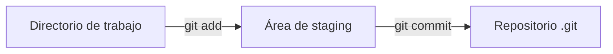
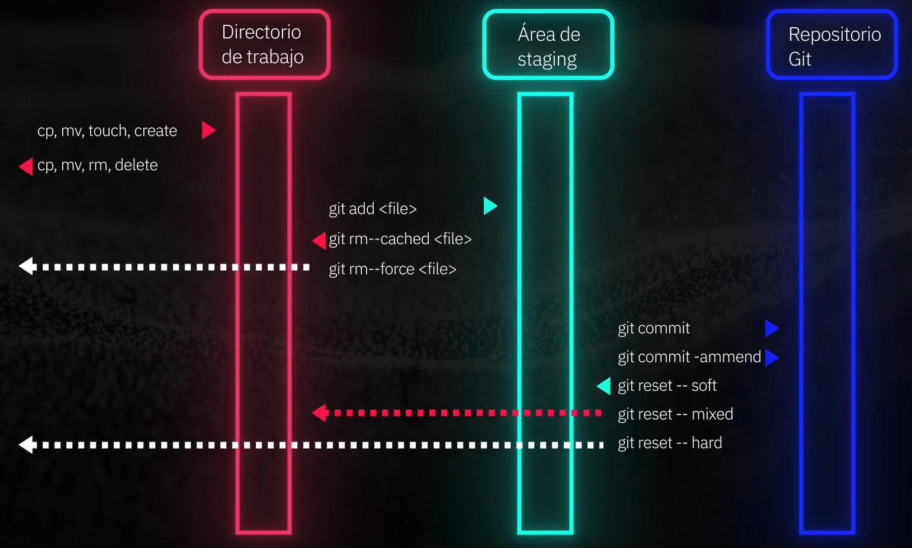

# Guia Git & GitHub

> Trabajo basado en:  
>
> | Titulo | Profesor |
> | ------ | -------- |
> |[Curso de Git y GitHub](https://platzi.com/cursos/gitgithub/ "Curso de Git y GitHub") | Amin Espinoza |
> |[Curso de Configuración de Entorno en Linux](https://platzi.com/cursos/entorno-linux/ "Curso de Configuración de Entorno en Linux") | Enrique devars |

Fuentes usadas:
<https://education.github.com/git-cheat-sheet-education.pdf>

by ssail

---

## Contenido

- [Guia Git \& GitHub](#guia-git--github)
  - [Contenido](#contenido)
  - [**Git** "*Sistema de control de versiones*"](#git-sistema-de-control-de-versiones)
  - [⚙️ Setup \& Init](#️-setup--init)
    - [🆕 `git init`](#-git-init)
    - [📥 `git clone [url]`](#-git-clone-url)
    - [📖 Resumen visual con Mermaid](#-resumen-visual-con-mermaid)
  - [🔧 Checking Configuration](#-checking-configuration)
    - [📑 `git --help`](#-git---help)
    - [🧾 `git config --list`](#-git-config---list)
    - [🔍 Consultar una clave específica](#-consultar-una-clave-específica)
    - [💡 Buenas prácticas](#-buenas-prácticas)
  - [⚙️ Setup](#️-setup)
    - [🛠️ `git config`](#️-git-config)
    - [👤 Configurar identidad del usuario](#-configurar-identidad-del-usuario)
    - [🎨 Colores en Git](#-colores-en-git)
    - [📝 Ver configuración actual](#-ver-configuración-actual)
    - [🖊️ Editor por defecto](#️-editor-por-defecto)
  - [📂 ¿Cómo se crean y agregan archivos a Git?](#-cómo-se-crean-y-agregan-archivos-a-git)
    - [✍️ Creación de archivos](#️-creación-de-archivos)
    - [🔎 Verificar estado](#-verificar-estado)
    - [➕ Agregar archivos al *staging area*](#-agregar-archivos-al-staging-area)
    - [🗑️ Quitar archivos del *staging area*](#️-quitar-archivos-del-staging-area)
    - [💾 Guardar cambios en el repositorio](#-guardar-cambios-en-el-repositorio)
    - [📖 Flujo visual básico](#-flujo-visual-básico)
  - [Flujo de trabajo "Diagrama de secuencia"](#flujo-de-trabajo-diagrama-de-secuencia)
  - [📍 STAGE \& SNAPSHOT](#-stage--snapshot)
  - [🌿 BRANCH \& MERGE](#-branch--merge)
  - [🔄 SHARE \& UPDATE](#-share--update)
  - [📂 TRACKING PATH CHANGES](#-tracking-path-changes)
  - [🗂️ TEMPORARY COMMITS (Stash)](#️-temporary-commits-stash)
  - [✍️ REWRITE HISTORY](#️-rewrite-history)
  - [🔎 INSPECT \& COMPARE](#-inspect--compare)
  - [🚫 IGNORING PATTERNS](#-ignoring-patterns)
  - [Ramas](#ramas)
    - [Rama Principal (Main o Master)](#rama-principal-main-o-master)
  - [Solución de conflictos de fusión](#solución-de-conflictos-de-fusión)
  - [Navegación de Historial y Corrección de errores](#navegación-de-historial-y-corrección-de-errores)
    - [git revert](#git-revert)
    - [git reset](#git-reset)
  - [Git checkout para gestion de verisiones y Revición](#git-checkout-para-gestion-de-verisiones-y-revición)
    - [Regresar a rama principal](#regresar-a-rama-principal)
    - [Version alterna a partir de un commit](#version-alterna-a-partir-de-un-commit)
  - [Tags o Etiquetas](#tags-o-etiquetas)
    - [git tag](#git-tag)
      - [Asignando etiquetas](#asignando-etiquetas)
      - [Manipulando etiquetas](#manipulando-etiquetas)
  - [Configuración deDDH en GitHub](#configuración-deddh-en-github)
  - [Uso de Forks y Estrella en Repositorios de GitHub](#uso-de-forks-y-estrella-en-repositorios-de-github)
  - [Uso de git pull, git push y git fetch en repositoios de GitHub](#uso-de-git-pull-git-push-y-git-fetch-en-repositoios-de-github)
    - [¿Cómo sincronizar tus repositorios con git pull, git push y git fetch?](#cómo-sincronizar-tus-repositorios-con-git-pull-git-push-y-git-fetch)
    - [¿Cómo usar git pull y git push para mantener tus repositorios sincronizados?](#cómo-usar-git-pull-y-git-push-para-mantener-tus-repositorios-sincronizados)
    - [¿Qué es y cómo utilizar git fetch?](#qué-es-y-cómo-utilizar-git-fetch)
    - [¿Cómo elegir entre git pull y git fetch?](#cómo-elegir-entre-git-pull-y-git-fetch)
  - [Creación de Plantillas de Issues en GitHub](#creación-de-plantillas-de-issues-en-github)
    - [¿Qué es un Issue en GitHub?](#qué-es-un-issue-en-github)
    - [¿Cómo crear un nuevo Issue?](#cómo-crear-un-nuevo-issue)
    - [¿Cómo crear una plantilla de Issues?](#cómo-crear-una-plantilla-de-issues)
    - [¿Cómo sincronizar los cambios en GitHub?](#cómo-sincronizar-los-cambios-en-github)
    - [¿Qué ventajas tiene una plantilla de Issues?](#qué-ventajas-tiene-una-plantilla-de-issues)
    - [¿Cómo personalizar las plantillas de Issues para casos específicos?](#cómo-personalizar-las-plantillas-de-issues-para-casos-específicos)
  - [Uso de Pull Request en GitHub para colaboración efectiva](#uso-de-pull-request-en-github-para-colaboración-efectiva)
    - [¿Por qué evitar cambios directos en la rama principal?](#por-qué-evitar-cambios-directos-en-la-rama-principal)
    - [¿Cómo funciona un Pull Request?](#cómo-funciona-un-pull-request)
    - [¿Qué papel juega la revisión de código?](#qué-papel-juega-la-revisión-de-código)
    - [¿Cómo se fusiona un Pull Request?](#cómo-se-fusiona-un-pull-request)
    - [¿Cómo puedo practicar Pull Requests de forma efectiva?](#cómo-puedo-practicar-pull-requests-de-forma-efectiva)
    - [Pasos que seguí](#pasos-que-seguí)
  - [Gestión de Proyectos con GitHub Projects: Planificación Colaborativa](#gestión-de-proyectos-con-github-projects-planificación-colaborativa)
    - [Introducción a GitHub Projects 🚀](#introducción-a-github-projects-)
    - [🎯 ¿Por qué usar GitHub Projects?](#-por-qué-usar-github-projects)
    - [1️⃣ Cómo Crear un GitHub Project](#1️⃣-cómo-crear-un-github-project)
  - [Automatización de flujos de trabajo en GitHub Projects](#automatización-de-flujos-de-trabajo-en-github-projects)
    - [¿Cómo vincular y personalizar un proyecto en GitHub?](#cómo-vincular-y-personalizar-un-proyecto-en-github)
    - [¿Cómo gestionar y actualizar actividades dentro del proyecto?](#cómo-gestionar-y-actualizar-actividades-dentro-del-proyecto)
    - [¿Cómo automatizar los cambios de estado en actividades?](#cómo-automatizar-los-cambios-de-estado-en-actividades)
    - [¿Cómo crear y enlazar un issue desde una actividad?](#cómo-crear-y-enlazar-un-issue-desde-una-actividad)
    - [¿Qué ventajas ofrece el flujo automatizado en GitHub?](#qué-ventajas-ofrece-el-flujo-automatizado-en-github)
  - [Recursos ecenciales de MarkDown para Documentación efectiva](#recursos-ecenciales-de-markdown-para-documentación-efectiva)
    - [Herramientas útiles para documentación](#herramientas-útiles-para-documentación)
    - [Extenciones para Visual Estudio Code](#extenciones-para-visual-estudio-code)
  - [Creación de una Portada de Perfil en GitHub con Markdown](#creación-de-una-portada-de-perfil-en-github-con-markdown)
    - [Herramientas de apoyo](#herramientas-de-apoyo)
    - [¿Cómo iniciar el repositorio especial en GitHub?](#cómo-iniciar-el-repositorio-especial-en-github)
    - [¿Cómo personalizar el README con Markdown?](#cómo-personalizar-el-readme-con-markdown)
    - [¿Cómo previsualizar y ajustar el archivo en Visual Studio Code?](#cómo-previsualizar-y-ajustar-el-archivo-en-visual-studio-code)
    - [¿Cómo añadir y ajustar badges en el perfil de GitHub?](#cómo-añadir-y-ajustar-badges-en-el-perfil-de-github)
    - [¿Qué estrategias aplicar para mejorar la portada en GitHub?](#qué-estrategias-aplicar-para-mejorar-la-portada-en-github)

---

## **Git** "*Sistema de control de versiones*"

> Creado por Linux Torvalds

## ⚙️ Setup & Init

Configura un nuevo proyecto de Git o clona uno existente.


---

### 🆕 `git init`

Inicializa un directorio vacío como **repositorio Git**.

```bash
git init
```

📌 **Qué hace:**

- Crea una carpeta oculta llamada `.git` que guarda todo el historial de versiones.
- Inicia la rama principal. Antiguamente se llamaba **master**, ahora por convención se usa **main**.

🔎 **Explicación del cambio de nombre de la rama:**

- `master` era el nombre por defecto, pero muchas comunidades lo reemplazaron por `main` para hacerlo más inclusivo y claro.
- **main** = rama principal, la base de tu proyecto.

⚙️ **Cómo definir siempre `main` como predeterminado:**

```bash
git config --global init.defaultBranch main
```

⚙️ **Cómo renombrar la rama actual a `main`:**

```bash
git branch -m main
```

- `git branch` → gestiona ramas.
- `-m` → move/rename (renombra la rama actual).
- `main` → el nuevo nombre.

---

### 📥 `git clone [url]`

Clona (descarga) un repositorio existente desde una URL remota.

```bash
git clone git@github.com:usuario/repositorio.git
```

📌 **Qué hace:**

- Copia todos los archivos, ramas e historial de commits.
- Te da una copia idéntica para trabajar en tu máquina.

🛠️ **Parámetros comunes:**

- `[url]` → Dirección del repositorio (HTTPS o SSH).
- `[directorio]` *(opcional)* → Nombre de la carpeta destino.

Ejemplo:

```bash
git clone git@github.com:Ssail-1/PlatziNotes.git mi-carpeta-local
```

👉 Esto clona el repo en una carpeta llamada `mi-carpeta-local` en lugar de usar el nombre original.

---

### 📖 Resumen visual con Mermaid

```mermaid
flowchart TD
  A[Directorio vacío] --> B[Repositorio Git (.git)] C[Repositorio remoto en GitHub] --> D[Copia local idéntica]
```

---
---

## 🔧 Checking Configuration

Verifica y consulta la configuración activa de Git en tu entorno.


---

### 📑 `git --help`

Muestra la ayuda oficial de Git con todas las opciones disponibles.

```bash
git --help
```

🛠️ **Atajos útiles:**

- `git help <comando>` → manual de un comando específico.

  ```bash
  git help commit
  ```

- `git <comando> --help` → lo mismo, otra forma de escribirlo.

  ```bash
  git commit --help
  ```

- `git -h` → ayuda corta, solo muestra las flags más comunes.

---

### 🧾 `git config --list`

Lista toda la configuración activa que Git está usando actualmente.

```bash
git config --list
```

📌 **Qué hace:**

- Muestra configuraciones de todos los niveles:

  - **Sistema** (`/etc/gitconfig`) → afecta a todos los usuarios de la computadora.
  - **Global** (`~/.gitconfig` o `~/.config/git/config`) → afecta solo a tu usuario.
  - **Local** (`.git/config`) → afecta únicamente al repo donde estás.
- Si un valor se repite, el nivel más cercano (local) tiene prioridad.

---

### 🔍 Consultar una clave específica

Si quieres ver el valor de una sola clave:

- `git config <key>`

Ejemplo:

```bash
git config user.name
```

👉 Te devuelve el nombre configurado para tus commits en ese repo.

---

### 💡 Buenas prácticas

- Usa **`--global`** para datos personales (nombre, email) que aplicarás a todos tus repos.
- Usa **local (sin flag)** si en un repo necesitas credenciales distintas (ej. cuenta secundaria).
- Para depuración, `git config --list --show-origin` te muestra **qué archivo exacto** definió cada configuración.

---
---

## ⚙️ Setup

Configura tu identidad y opciones básicas de Git para que todos tus commits estén bien registrados.


---

### 🛠️ `git config`

El comando `git config` gestiona la configuración de Git en distintos niveles:

```bash
git config [nivel] <clave> <valor>
```

📌 **Niveles de configuración:**

| Flag / Parámetro | Alcance                        | Archivo que modifica                    |
| ---------------- | ------------------------------ | --------------------------------------- |
| `--system`       | Todos los usuarios del sistema | `/etc/gitconfig`                        |
| `--global`       | Solo tu usuario actual         | `~/.gitconfig` o `~/.config/git/config` |
| *(sin flag)*     | Solo el repo actual            | `.git/config` dentro del repo           |

👉 Si un valor se repite, el **nivel más específico (local)** tiene prioridad.

---

### 👤 Configurar identidad del usuario

```bash
git config --global user.name "Tu Nombre"
git config --global user.email "tuemail@example.com"
```

* `user.name` → el nombre que aparecerá en los commits.
* `user.email` → el correo vinculado (debe coincidir con el de tu cuenta GitHub si quieres que aparezcan tus contribuciones).

---

### 🎨 Colores en Git

```bash
git config --global color.ui auto
```

📌 **Qué hace:**

* `color.ui` controla si Git usa colores en la terminal.
* `auto` → activa colores cuando la salida es una terminal (lo más práctico).

👉 Esto mejora la lectura de `git status`, `git diff`, etc.

---

### 📝 Ver configuración actual

```bash
git config --list
```

👉 Lista todas las configuraciones activas (se mezclan system, global y local).

```bash
git config user.name
```

👉 Devuelve el valor de una clave específica.

---

### 🖊️ Editor por defecto

Git usa un editor de texto para escribir mensajes de commit si no pasas `-m`.

Por defecto:

* En Linux/Mac suele ser **Vim**.
* Puedes cambiarlo, por ejemplo a **Emacs** o **Nano**:

```bash
git config --global core.editor emacs
```

```bash
git config --global core.editor nano
```

---

💡 **Buenas prácticas**

* Configura siempre tu nombre y correo globales al empezar en una máquina.
* Usa un editor que conozcas (si no te gusta Vim, cámbialo).
* Revisa con `git config --list --show-origin` para ver qué archivo estableció cada valor.

---

✅ Con esto tu entorno queda listo para empezar a trabajar en cualquier repo con tu identidad clara y sin sorpresas de editor.

---
---

## 📂 ¿Cómo se crean y agregan archivos a Git?

Una vez que inicializas un repositorio con `git init`, puedes empezar a crear archivos y agregarlos al control de versiones.


---

### ✍️ Creación de archivos

Puedes crear archivos con tu editor de preferencia, por ejemplo:

```bash
nano notas.md
```

📌 Luego confirmas su existencia con:

```bash
ls
```

---

### 🔎 Verificar estado

```bash
git status
```

📌 **Qué hace:**

* Muestra qué archivos están sin seguimiento (*untracked*).
* Qué archivos ya están en el área de preparación (*staging*).
* En qué rama te encuentras.

👉 Es tu **mapa de situación** antes de cualquier commit.

---

### ➕ Agregar archivos al *staging area*

```bash
git add nombre_archivo.txt
```

📌 **Qué hace:**

* Mueve el archivo al área de preparación (*staging*).
* Indica que ese archivo estará listo para el próximo commit.

🛠️ Variantes:

* `git add .` → agrega todos los archivos del directorio actual.
* `git add -A` → agrega todos los cambios, incluyendo eliminaciones y renombres.

---

### 🗑️ Quitar archivos del *staging area*

```bash
git reset nombre_archivo.txt
```

👉 Saca el archivo del *staging area*, pero conserva los cambios en tu directorio de trabajo.

```bash
git rm --cached nombre_archivo.txt
```

👉 Similar a `reset`, **pero** pensado para remover un archivo del control de versiones (queda en tu carpeta, pero Git lo ignora).

```bash
git rm --force nombre_archivo.txt
```

👉 Borra el archivo tanto del *staging area* como del directorio de trabajo.

---

### 💾 Guardar cambios en el repositorio

```bash
git commit -m "Descripción clara del cambio"
```

📌 **Qué hace:**

* Crea un *snapshot* de los archivos en staging.
* Registra ese cambio en el historial del proyecto.

👉 Si olvidas `-m`, se abrirá tu editor configurado (Vim, Nano, etc.) para escribir el mensaje.

---

### 📖 Flujo visual básico



---

💡 **Buenas prácticas**

* Usa mensajes de commit descriptivos (ej. `"Agrego sección Setup & Init"`).
* No subas archivos binarios grandes ni temporales (usa `.gitignore`).
* Antes de cada commit, revisa siempre con `git status` qué estás incluyendo.

---

✅ Listo este bloque, ya tienes el flujo claro de **crear → agregar → confirmar**.

## Flujo de trabajo "Diagrama de secuencia"
---

[Clase 3](https://platzi.com/cursos/gitgithub/comandos-basicos-de-git-add-commit-log/ "Control de Versiones con Git: Comandos Básicos y flujo de Trabajo")  


<Noa> En la imagen anterior aparecen comandos que se pueden realizar a nivel de directorio de trabajo como cp, mv, touch, create, rm, delete etc, despues a nivel de area de staging git add para agregar, git rm--cached para sacar un archivo del area de staging y git rm--force que hace lo mismo creo, pero no se la diferencia, y a nivel de repositorio de git git commit, git commit-ammend para ingresar a repo, y git reset--soft que lleva el archivo al area de staging, git reset--mixed lleva el archivo al directorio de trabajo y git reset --hard elimina definitivamente los archivos, te digo esto porque estaria bueno que despues de la imagen hagas una descripción mejor que la que te di para explicar la imagen y ponela con un formato bonito de .md que se vea como pie de foto.
Tambien si en el documento no ves que ponga información de estos comandos, porfa tu agregalos. Los de directorio de trabajo como cp, mv y esos no porfa, porque pues eso es de linea de comandos y estamos en git</Noa>

<Noa> Desde aqui hasta donde te vuelva a indicar, esta es información que saque de un pdf ayuda de gitHub, lo integre porque se me hace mas facil hacer apuntes y me parecio genial porque viene por secciones, no se si es bueno, pero si lo es, me gustaria que lo integraras a este trabajo y si tienes que modificarlo para hacerlo mas digerible sabes que puedes.
Actualizacion jaja: trata de mejorar demaciado sus definiciones o descripciones porque no son muy buenas, conforme sigo el curso me doy cuenta que a estas tambien les falta mas crema.
Eso de crema es una expreción de ponerle mas crema a los tacos jaja, yo le digo crema porque no me gusta tanto la salsa, le falle a méxico :'v jaja</Noa>  

## 📍 STAGE & SNAPSHOT

*Trabajando con instantáneas y el área de preparación de Git*

- `git status`
  Muestra los archivos modificados en el directorio de trabajo y cuáles están preparados (*staged*) para el próximo commit.

- `git add [archivo]`
  Agrega un archivo (tal como está en ese momento) al área de preparación (*stage*) para incluirlo en el próximo commit.

- `git reset [archivo]`
  Saca un archivo del área de preparación o staging, pero conserva los cambios en el directorio de trabajo. <Noa>Aqui me entro duda es diferente git reset [archivo] que git rm --cached y --force?, explica eso, si es necesario aqui incluye esos dos comandos que te di</Noa>

- `git diff`
  Muestra las diferencias de lo que ha cambiado pero aún **no** está preparado.

- `git diff --staged`
  Muestra las diferencias de lo que está en el área de preparación pero aún no se ha hecho commit.

- `git commit -m "[mensaje descriptivo]"`
  Guarda los archivos preparados como un nuevo *snapshot* (commit) en la historia del proyecto.

---

## 🌿 BRANCH & MERGE

*Aislar trabajo en ramas, cambiar contexto e integrar cambios*

- `git branch`
  Lista todas las ramas. El `*` indica la rama activa.

- `git branch [nombre-rama]`
  Crea una nueva rama en el commit actual.

- `git checkout [rama]`
  Cambia a otra rama y actualiza el directorio de trabajo.

- `git merge [rama]`
  Fusiona la rama especificada en la actual.

- `git log`
  Muestra todos los commits de la rama actual.

---

## 🔄 SHARE & UPDATE

*Obtener actualizaciones de otros repositorios y actualizar el local*

- `git remote add [alias] [url]`
  Agrega una URL remota con un alias.

- `git fetch [alias]`
  Descarga todas las ramas del repositorio remoto.

- `git merge [alias]/[rama]`
  Fusiona una rama remota en la rama local actual.

- `git push [alias] [rama]`
  Envía los commits locales de una rama al repositorio remoto.

- `git pull`
  Descarga y fusiona cambios del remoto en la rama actual.

---

## 📂 TRACKING PATH CHANGES

*Versionar eliminaciones y cambios de ruta de archivos*

- `git rm [archivo]`
  Elimina el archivo del proyecto y prepara la eliminación para el commit.

- `git mv [ruta-existente] [nueva-ruta]`
  Cambia el nombre o mueve un archivo, y prepara ese cambio para el commit.

- `git log --stat -M`
  Muestra los commits junto con los archivos movidos o renombrados.

---

## 🗂️ TEMPORARY COMMITS (Stash)

*Guardar temporalmente cambios para cambiar de rama*

- `git stash`
  Guarda los cambios modificados o preparados en un “almacén temporal”.

- `git stash list`
  Lista las entradas guardadas en el stash.

- `git stash pop`
  Recupera los cambios guardados y los aplica al directorio de trabajo.

- `git stash drop`
  Descarta los cambios guardados en el stash.

---

## ✍️ REWRITE HISTORY

*Reescribir ramas, actualizar commits y limpiar historial*

- `git rebase [rama]`
  Aplica los commits de la rama actual sobre la rama especificada.

- `git reset --hard [commit]`
  Borra el área de preparación y restaura el directorio de trabajo al estado del commit dado. ⚠️ (peligroso, puede perder cambios).

---

## 🔎 INSPECT & COMPARE

*Examinar logs, diferencias e información de objetos*

- `git log`
  Muestra el historial de commits de la rama activa.

- `git log branchB..branchA`
  Muestra los commits que están en `branchA` pero no en `branchB`.

- `git log --follow [archivo]`
  Muestra el historial de commits de un archivo, incluso si fue renombrado.

- `git diff branchB...branchA`
  Muestra las diferencias entre `branchA` y `branchB`.

- `git show [SHA]`
  Muestra un objeto de Git (commit, archivo, etc.) en un formato legible.

---

## 🚫 IGNORING PATTERNS

*Evitar que ciertos archivos se suban al repositorio*

- `git config --global core.excludesfile [archivo]`
  Define un archivo global de patrones de exclusión para todos los repositorios.

- **Ejemplo de `.gitignore`**

  ```gitignore
  logs/
  *.notes
  pattern*/
  ```

  Guarda un archivo llamado `.gitignore` en tu proyecto para especificar qué archivos o carpetas deben ignorarse.

---
<Noa> De aqui sigo con los apuntes propios y me gustaría que integraras en lo demas en las secciones correspondientes </Noa>

---

`git rm --cached [Archivo]` -> Remueve el archivo del area de staging y pasandolo

`git rm --force [Archivo]` -> Remueve archivos que el sistema normalmente eliminaria

<Noa>El profe uso estos comandos, no los entendí y me revolví por lo que anteriormente te habia mencionado, agregalos por si despues no los agrego a mis notas, son estos: git rm --force [archivo] ; git commit -ammend ; git reset --soft ; git reset --mixed ; git reset --hard. Y tambien he visto que las flags o parametros tienen acronimos como --force -f, eso me gustaría que explicaras porque y cual conviene usar y si puedes de todos los comandos que estan en este documento pon el comando largo y corto si es que hay, como cuando hicimos el de linea de comandos, me dabas el comando completo y despues me decias que había uno mas corto que hacia lo mismo. </Noa>

---

`git add .` -> Ingresa todos los archivos que se encuentren en el directorio actual.

`git commit -m "Descripcion del cambio"` -> Lleva el archivo al repositorio o control de versiones

## Ramas

Una rama es un directorio donde creamos trabajamos sobre el trabajo original creando desarrollando versiones que no afectan al flujo principal y así cada desarrollador puede trabajar en conjunto o bien solo uno.

### Rama Principal (Main o Master)

Por defecto git llama Master a la rama principal pero por convención, estandar y buenas practicas le cambiamos el nombre a main y sobre esta podemos crear varias ramas independientes.

Checkout  
Así le llamamos al proceso de crear una rama independiente

Development  
Es el nombre que le asignamos a la rama sobre la que estamos desarrollando.

Hotfix  
Es la forma en la que le llamamos a la rama donde estamos solucionando un bug o un error.

Merge  
Es el proceso de combinar ramas

<Noa> Creo que esta aclaración del Head no va aquí, tambien me gustaria que me dijeras porque ahay que tener en cuenta que al hacer merge puede gerear conflictos que hay que solucionar quien hace el commit, la duda es porque si trabaje sobre un archivo.js ejemplo y al hacer commit, se actualiza en que tiene el mismo nombre o hay que eliminar el que estaba en el repo y dejar el que subimos o como, como que no entiendo cual sería el conflicto. </Noa>
HEAD  
Indica el commit donde estamos trabajando.

- `git branch <Nombre de rama>` -> Indica en que rama te encuentras con un *  

Crea la rama y te lleva a ella

- `git checkout -b <Nombre de rama>`
- `git switch -c <NameBranch>`

Saltos entre ramas

- `git checkout <branch>` -> En deshuso
- `git switch <branck>` -> forma actual

Unificación de ramas

1. Saltar a la rama donde se unificara para recibir nueva rama
2. `git merge <rama a fucionar>`

Eliminación de ramas  
`git branch -D <Rama a eliminar>`

---

## Solución de conflictos de fusión

<Noa> Aqui explica lo del conflicto, ya en otra clase explico el profesor sobre el conflicto, este se da cuando dos ramas diferentes hacen cambios distintos a un mismo archivo en las mismas lineas. Al hacer merge git nos avisa de ello y la solución es abrir el archivo y modificarlo como nosotros lo deseemos.
git coloca con caracteres <, >, -, donde hay conflictos y marca los lugares donde se hacen los cambios con punteros como head y developer creo, el archivo se puede abrir en nano pero VSCode nos ayuda a resolver estos conflictos sin necesidad de borrar o escribir mas lineas de codigo  automatizando la solución, explica esto y el proceso de VSCode. Mientras se soluciona el conflicto el archivo se encuentra en un estado llamado **Unmerged** y cuando ya esta solucionado terminados el commit.</Noa>

## Navegación de Historial y Corrección de errores

<Noa> Desarrolla este tema tu Noa, que estoy perdido </Noa>

Para regresar a una verión anterior tenemos varios metodos...

### git revert

`git revert <hash-commit>` -> Revierte los cambios de un commit

### git reset

`git reset --hard <hash-HEAD>` -> Desecha los cambios locales dejando como cabezera el hash indicado, eliminando archivos e historial que habia despues de hash

`git reset --soft [hash-commit]` -> permite eliminar los archivos  
`git reset --mixed [hash-commit]` -> regresa los commits  

`git reset` -> puede eliminar todo
<Noa> Explicalo mejor que yo que no entendí </Noa>

## Git checkout para gestion de verisiones y Revición

```shell
git checkout [hash-commit]
```

Este comando sirve para volver a cualquier version del historial sin afectar la integridad del historial.

- Es este estado temporal puedes hacer pruebas y no afectara la rama principal

### Regresar a rama principal

`git checkout main`

### Version alterna a partir de un commit

`git switch -c [new-branch-name]`

`git checkout master` <Noa>Este no se si es correcto, mecionaban que era para volver a la ultima version de un archivo, o rama, no se si hay dos comandos diferentes, pero si fuera para un archivo hace falta saber donde se pone el nombre del archivo como argumento, y otra duda, si la rama principal se llama main, entonces va main en lugar de Master?</Noa>

## Tags o Etiquetas

### git tag

Utiles para marcar los commits mas importante. Nos dan una referencia de la evolución del proyecto, tienen mucha funcionalidad en GitHub.

```shell
git tag -a [tag] -m "Descripción o ser del tag"
```

#### Asignando etiquetas

Se vería algo así:

```shell  
git tag -a [nameTag] [hash-commit] -m "Descripcion mensaje"
```

Publicar un tag en el repositorio remoto:  
`git push origin --tags`

#### Manipulando etiquetas

Mostrar o listar los tags  

- `git tag`
- `git show-ref --tags` -> Lista los tags y muestra que commit esta asociado a cada tag.

`git show <etiqueta>` o `di -> Muestra toda la información asociada a esta etiqueta...

Borrar la etiqueta:  
Localmente ->

- `git tag -d <etiqueta>`

Cuando borramos un tag en local, este no se borra en el repositorio remoto.

Repositorio Remoto ->

1. Borramos el tag localmente
2. Borramos el remoto con: `git push origin :refs/tags/nombre-del-tag`

`git tag -a <etiqueta> <hash de commit> -m "Mensaje de tag"` -> Coloca una etiqueta al commit indicado

`git clone [url]` -> Clona el repositorio en el directorio donde nos encontramos

## Configuración deDDH en GitHub

<Noa>Aqui me gustaria que expliques porque es importante, en que casos se usa comunmente y lo importante que creas y si el proceso no es tan bueno mejoralo, tambien explica lo que significan los parametros, o que significa cada comando, es algo que ya te habia dicho al inicio pero por si acaso. </Noa>

Para configurar SSH en GitHub, sigue estos pasos:

1. Genera una clave SSH:

    - Abre tu terminal.
    - Ejecuta: ssh-keygen -t ed25519 -C "<tu_correo@example.com>" y sigue las instrucciones para crear la clave.

2. Inicia el agente SSH:

    - Ejecuta: eval "$(ssh-agent -s)".
    - Luego, agrega tu clave privada: ssh-add ~/.ssh/id_ed25519.

3. |Copia la clave pública:

    - Usa cat ~/.ssh/id_ed25519.pub para visualizarla y cópiala.

4. Añade la clave a GitHub:

    - Ve a GitHub, en "Settings" > "SSH and GPG keys", y selecciona "New SSH key". Pega tu clave pública.

5. Prueba la conexión:

    - Ejecuta: ssh -T <git@github.com>. Deberías ver un mensaje de éxito.

Con esto, habrás configurado SSH para GitHub de forma segura y eficiente.

Usar SSH para interactuar con GitHub es una excelente forma de aumentar la seguridad y mejorar la comodidad en el manejo de repositorios. A continuación, te explicamos el paso a paso para generar y configurar tus llaves SSH en distintos sistemas operativos y cómo integrarlas en tu perfil de GitHub para mejorar la experiencia de clonación y autenticación.

¿Por qué es mejor usar SSH en lugar de HTTPS para GitHub?
Seguridad adicional: SSH permite autenticar la computadora específica que accede a los repositorios sin necesidad de ingresar una contraseña cada vez.
Comodidad: Evita la necesidad de escribir tu contraseña en cada operación con GitHub, agilizando el flujo de trabajo.
¿Cómo generar una llave SSH en Windows y Linux?
Instalar WSL si estás en Windows (opcional si usas Linux nativo).
Verificar que no tienes llaves previas: Ve al menú de “Code” en GitHub y verifica que la opción de SSH no tenga llaves configuradas.
Generar la llave SSH: En la terminal, usa el comando:
ssh-keygen -t ed25519 -C "<tu_correo@example.com>"
-t ed25519 establece el nivel de encriptación.
-C añade un comentario con tu correo, útil para identificar la llave en GitHub.
Guardar y proteger la llave:
Usa el nombre por defecto y añade una contraseña segura.
La llave pública se guarda en el directorio .ssh, generalmente nombrada id_ed25519.pub.
Configurar el agente SSH: Activa el agente de SSH y añade la llave privada:
eval "$(ssh-agent -s)"
ssh-add ~/.ssh/id_ed25519
¿Cómo añadir la llave SSH a GitHub?
Abrir el archivo de la llave pública (id_ed25519.pub) y copia el contenido.
En GitHub, ve a Settings > SSH and GPG keys > New SSH key y pega la llave.
Nombra la llave de acuerdo a la computadora en la que estás configurándola.
¿Qué pasos adicionales seguir en Mac?
Crear el archivo de configuración SSH: Abre o crea el archivo config dentro del directorio .ssh.

Agregar parámetros específicos de Mac: Añade la configuración para integrar SSH con el sistema Keychain:

Host github.com
   AddKeysToAgent yes
   UseKeychain yes
   IdentityFile ~/.ssh/id_ed25519
Añadir la llave al agente SSH con Keychain: Usa el comando:

ssh-add --apple-use-keychain ~/.ssh/id_ed25519
¿Cómo verificar la conexión con GitHub?
Comprobar autenticación: En la terminal, ejecuta el comando:
ssh -T <git@github.com>
Escribe “yes” para confirmar la conexión.
Aparecerá un mensaje de GitHub que confirma la autenticidad.
¿Cómo clonar un repositorio usando SSH?
En GitHub, selecciona el repositorio deseado, elige la opción de clonación por SSH y copia la URL.
En la terminal, ejecuta:
git clone <git@github.com>:usuario/repositorio.git
Esto clona el repositorio sin solicitar contraseña, aprovechando la autenticación SSH.

## Uso de Forks y Estrella en Repositorios de GitHub

<Noa>Este tema no es tan complejo, pegue el apunte del curso, lo puedes resumir o poner solo las cosas importantes</Noa>

Entender el uso de forks y estrellas en GitHub optimiza la gestión de proyectos y recursos al trabajar en esta plataforma. Aquí exploraremos cómo funcionan estos elementos y cómo pueden ayudarte a organizar tus repositorios en función de tus necesidades.

¿Qué es un fork y cómo se utiliza?
Un fork en GitHub es una copia de un repositorio alojado en la cuenta de otra persona y que puedes transferir a tu propia cuenta. Este proceso crea una réplica del repositorio en su estado actual, sin reflejar futuros cambios del original a menos que se sincronice manualmente. Esto permite:

Trabajar de manera independiente en un proyecto sin afectar el repositorio original.
Personalizar el contenido según tus necesidades sin modificar el repositorio fuente.
Crear una base para hacer contribuciones posteriores al repositorio original.
Para crear un fork, debes abrir el repositorio, seleccionar el botón de Fork y seguir los pasos para copiarlo en tu cuenta. Así, GitHub duplicará el repositorio, manteniendo el nombre y descripción del original. Puedes optar por copiar solo la rama principal (main) o todo el proyecto. Luego, desde tu cuenta, podrás modificar el contenido sin interferir con el repositorio original.

¿Qué beneficios aporta usar estrellas en GitHub?
Las estrellas en GitHub funcionan como un sistema de marcado para resaltar los repositorios que deseas tener a mano como referencia o favoritos. Son útiles para:

Crear un índice de repositorios de referencia o inspiración.
Acceder rápidamente a recursos clave desde tu perfil.
Seguir el desarrollo de proyectos importantes para tus intereses.
Al seleccionar la estrella en un repositorio, ésta se ilumina para indicar que has marcado este recurso. Puedes acceder a todos tus repositorios marcados desde la sección de “tus estrellas” en tu perfil. Aquí se listan los proyectos que has destacado, ayudándote a centralizar tus fuentes de consulta.

¿Cómo clonar un repositorio forkeado?
Después de realizar un fork, puedes clonar este repositorio a tu entorno local para trabajar de forma directa en tu equipo. Para hacerlo:

Ve a tu repositorio forkeado.
Selecciona el botón Code y copia la URL del proyecto en formato SSH.
Abre la terminal y usa el comando git clone .
De esta manera, tendrás una versión local del repositorio en la que podrás modificar y gestionar el código. Esta técnica de fork y clonación es útil para personalizar proyectos o experimentar sin afectar el original, ofreciendo flexibilidad para hacer cambios sin alterar el repositorio fuente.

¿Por qué usar forks en lugar de clonar directamente el repositorio original?
Hacer un fork en lugar de una clonación directa del repositorio original permite que trabajes de manera independiente. Puedes hacer ajustes sin el riesgo de cambiar el repositorio base, especialmente útil cuando el original es de terceros o si planeas realizar cambios extensivos. Además, el fork es una base ideal para hacer contribuciones futuras, ya que se puede sincronizar y enviar cambios al proyecto original a través de un proceso estructurado.

## Uso de git pull, git push y git fetch en repositoios de GitHub

### ¿Cómo sincronizar tus repositorios con git pull, git push y git fetch?

La gestión de repositorios es una habilidad esencial en el desarrollo de software moderno. Git y GitHub permiten a los desarrolladores colaborar y sincronizar cambios de manera eficiente. Aquí te explicaremos cómo los comandos git pull, git push y git fetch juegan un papel crucial en este proceso, ayudándote a entender cuándo y cómo utilizarlos para mantener tus repositorios actualizados.

### ¿Cómo usar git pull y git push para mantener tus repositorios sincronizados?

El comando git pull se utiliza para actualizar tu repositorio local con los cambios que se han producido en la nube, específicamente en GitHub. Esta acción es esencial cuando deseas asegurarte de que tu entorno local refleje las últimas modificaciones realizadas en el repositorio compartido.

Por otro lado, git push tiene la función opuesta: permite subir tus cambios locales al repositorio en la nube. Esto es fundamental para colaborar con otros desarrolladores, garantizando que todos los cambios se integren en el proyecto general.

Script de ejemplo para git pull y git push

```
# Para verificar la rama activa y actualizar el repositorio local

$ git branch                # Verifica la rama activa
$ git pull origin main      # Jala los últimos cambios de la rama main en GitHub

# Para subir cambios desde el repositorio local a la nube
$ git add .                 # Prepara los archivos para el commit
$ git commit -m "Descripción del cambio" # Realiza el commit
$ git push origin main      # Sube los cambios a GitHub
```

### ¿Qué es y cómo utilizar git fetch?

El comando git fetch es útil cuando deseas descargar los cambios sin aplicarlos inmediatamente. Difiere de git pull, ya que te permite evaluar primero los cambios antes de fusionarlos con tu rama local. Este enfoque resulta valioso cuando se espera una revisión antes de integrar los cambios en el entorno local.

Ejemplo práctico de git fetch

```
# Descargar cambios sin aplicarlos de inmediato
$ git fetch origin                # Jala los cambios de la rama origen

# Comparar y evaluar diferencias entre ramas
$ git log main..origin/main       # Compara las diferencias entre la rama local y la remota

# Una vez evaluados, fusionar cambios en la rama local
$ git merge origin/main           # Fusiona los cambios evaluados
```

### ¿Cómo elegir entre git pull y git fetch?

git pull: Rápido y directo, ideal cuando se confía en los cambios remotos y se necesita una actualización inmediata de la rama local.
git fetch: Más cauteloso, ofrece una etapa de evaluación antes de integrar los cambios, evitando sincronizaciones no deseadas.
Elige el comando que mejor se adapte a tu situación y flujo de trabajo. Recuerda siempre sincronizar tus cambios entre local y remoto para mantener la integridad del proyecto y facilitar la colaboración.

Con estos comandos como parte de tu arsenal, tendrás la habilidad de mantener tus proyectos bien organizados y listos para la colaboración. Sigue explorando y practicando en diferentes escenarios para reforzar estas habilidades esenciales en el manejo de Git y GitHub. ¡Adelante, y sigue aprendiendo!

<Noa>El profe uso fit [push -u origin main] pero no se porque puso -u </Noa>

## Creación de Plantillas de Issues en GitHub

Usar los Issues de GitHub permite gestionar y documentar problemas en un repositorio, desde errores simples en la redacción hasta defectos complejos en la funcionalidad. Con una interfaz intuitiva, permite que cualquier usuario señale y describa aspectos mejorables, y con plantillas de Issues, mejora la claridad y colaboración en el proceso.

### ¿Qué es un Issue en GitHub?

Un Issue es una forma de señalar problemas o sugerencias dentro de un repositorio. Puede ser usado para:

Notificar errores en la documentación, como faltas de ortografía.
Reportar problemas en el funcionamiento esperado del código.
Informar mejoras o cambios necesarios.
Los Issues permiten una comunicación bidireccional entre los colaboradores y el creador del repositorio, lo que facilita la resolución de problemas.

### ¿Cómo crear un nuevo Issue?

1. En el repositorio de GitHub, selecciona la pestaña Issues.
2. Haz clic en New Issue y describe el problema en dos campos principales:
    - Título: Una breve descripción.
    - Descripción: Detalles del problema, pasos para reproducirlo, etc.  

Es posible agregar elementos adicionales, como asignar el Issue a otra persona o etiquetarlo.

### ¿Cómo crear una plantilla de Issues?

Para facilitar el proceso a otros colaboradores, es útil crear plantillas de Issues. Para hacerlo:

1. Desde el repositorio, abre Visual Studio Code con el comando code ..
2. Crea una carpeta llamada .github y dentro otra carpeta llamada ISSUE_TEMPLATE.
3. Dentro de ISSUE_TEMPLATE, crea un archivo Markdown (por ejemplo, bug_report.md).
4. Copia la estructura de la plantilla, que usualmente incluye secciones como descripción, pasos para reproducir el error y detalles adicionales.

Con esta plantilla, los colaboradores tendrán un formato estándar para reportar problemas, lo que ayuda a una mejor gestión y resolución.

### ¿Cómo sincronizar los cambios en GitHub?

1. Una vez creada la plantilla, verifica que los archivos cambiados estén marcados en verde en Visual Studio Code.
2. Realiza un commit (por ejemplo, “Bug Report agregado”).
3. Sincroniza con el repositorio de GitHub mediante el botón de flecha hacia arriba (push).
4. En GitHub, verifica que la plantilla esté disponible en la sección de Issues.

### ¿Qué ventajas tiene una plantilla de Issues?

Las plantillas simplifican el proceso de documentación de problemas y mejoran la comunicación al estandarizar la información que se solicita a los colaboradores. Esto ayuda a identificar los problemas de forma precisa y rápida.

### ¿Cómo personalizar las plantillas de Issues para casos específicos?

Además de la plantilla básica para bugs, puedes crear plantillas personalizadas como:

- Document Report: Para señalar errores en la documentación.
- Mejores prácticas: Para sugerir mejoras en la estructura del código.

Estas plantillas permiten a los colaboradores elegir el tipo de Issue que mejor se adapta al problema y agilizan la gestión del repositorio.

## Uso de Pull Request en GitHub para colaboración efectiva

Colaborar en GitHub requiere evitar modificar directamente la rama principal, lo que podría causar conflictos con el trabajo de otros compañeros. En su lugar, trabajar en ramas individuales y fusionarlas mediante Pull Requests (PR) es clave para un flujo de trabajo colaborativo y seguro.

### ¿Por qué evitar cambios directos en la rama principal?

Realizar cambios directamente en la rama principal (main) puede sobrescribir el trabajo no sincronizado de otros colaboradores. Este error común se evita al:

- Crear una rama separada para cada contribuyente.
- Fusionar cambios mediante una revisión en el Pull Request, antes de unirlos a la rama principal.

### ¿Cómo funciona un Pull Request?

1. Crear una Rama Nueva: Al iniciar cambios, crea una rama local específica. Por ejemplo, developer01.
2. Subir la Rama a GitHub: Usa git push -u origin  para subir tu rama.
3. Notificar al Equipo: Al crear un Pull Request, notificas al equipo sobre tus cambios, lo que permite una revisión colaborativa (Code Review).

### ¿Qué papel juega la revisión de código?

El Code Review en los Pull Requests permite:

- Evaluar y comentar los cambios antes de fusionarlos.
- Aumentar la calidad y la visibilidad de los cambios propuestos.

Aunque puede ser intimidante al principio, esta práctica asegura transparencia y mejora continua en el equipo.

### ¿Cómo se fusiona un Pull Request?

1. Comparación y Revisión: Una vez que el equipo revisa los cambios y los aprueba, GitHub facilita la fusión con la rama principal.
2. Resolver Conflictos: GitHub verifica automáticamente conflictos potenciales, mostrando una marca verde si está listo para fusionarse sin problemas.
3. Eliminar la Rama: Tras la fusión, se elimina la rama para mantener el repositorio ordenado y listo para nuevas tareas.

### ¿Cómo puedo practicar Pull Requests de forma efectiva?

Para mejorar, colabora con un amigo o colega, practicando la creación y revisión de Pull Requests. Esta interacción entre ramas te ayudará a familiarizarte y a fluir con confianza en el proceso de colaboración en GitHub.

### Pasos que seguí

1. Se crea una nueva rama y se hacen los cambios
2. Se hace un `git add .` y un `git commit -m "mensaje"` o bien un `git commit -am "mensaje"`
3. Subimos los cambios en la nueva rama `git push --set-upstream origin nameBranch` o `git push -u origin nameBranch`
4. En GitHub hacemos un Compare & pull request
5. Esperamos el code review por parte de los colaboradores
6. Una vez cumplido el objetivo de la rama, podemos eliminar esta.

## Gestión de Proyectos con GitHub Projects: Planificación Colaborativa

### Introducción a GitHub Projects 🚀

GitHub Projects es una herramienta integrada en GitHub que permite gestionar proyectos de forma visual y organizada, combinando issues, pull requests y notas en tableros personalizables.

### 🎯 ¿Por qué usar GitHub Projects?

✅ Facilita la planificación y seguimiento del trabajo. ✅ Se integra con Issues y Pull Requests automáticamente. ✅ Permite organizar tareas en tableros estilo Kanban o listas. ✅ Soporta automatización con GitHub Actions. ✅ Ideal para equipos y proyectos individuales.

### 1️⃣ Cómo Crear un GitHub Project

Sigue estos pasos para iniciar un Project en GitHub:

📌 1. Acceder a GitHub Projects
Ve al repositorio donde quieres gestionar el proyecto.
Haz clic en la pestaña "Projects".
Presiona "New project".
📌 2. Elegir el Tipo de Proyecto
Puedes elegir entre:

Table (tablas personalizadas con filtros avanzados).
Board (tablero estilo Kanban, similar a Trello).
Elige el que mejor se adapte a tu flujo de trabajo.

📌 3. Configurar el Proyecto
Asigna un nombre y descripción.
Agrega columnas o estados (Ej: "To Do", "In Progress", "Done").
Agrega Issues o Pull Requests arrastrándolos al tablero.
2️⃣ Uso Básico de GitHub Projects
Una vez creado, puedes gestionar el trabajo de manera eficiente:

📌 1. Agregar Tareas (Items)
Puedes añadir Issues o PRs existentes al proyecto.
También puedes crear notas personalizadas para otras tareas.
📌 2. Organizar el Trabajo con Columnas
To Do → Tareas pendientes.
In Progress → Tareas en desarrollo.
Done → Tareas completadas.
Puedes personalizar columnas según tu flujo de trabajo.

📌 3. Automatizar con GitHub Actions
Puedes configurar automatizaciones como: ✅ Mover un Issue a "In Progress" cuando se asigne. ✅ Marcar como "Done" cuando se cierre un Pull Request.

3️⃣ Ejemplo de Flujo de Trabajo con GitHub Projects
🔹 1. Crear un Issue → Se registra una tarea o bug. 🔹 2. Mover a "In Progress" → Se asigna a un desarrollador. 🔹 3. Crear un Pull Request → Se suben los cambios. 🔹 4. Revisar el Código → Se aprueba el PR. 🔹 5. Fusionar y Cerrar el Issue → Se mueve a "Done".

🚀 Resultado: Un equipo bien organizado y un código de mejor calidad.

🎯 Conclusión
✅ GitHub Projects ayuda a organizar y visualizar tareas en un proyecto. ✅ Se integra con Issues, Pull Requests y GitHub Actions. ✅ Es una herramienta poderosa para equipos y desarrolladores individuales.

## Automatización de flujos de trabajo en GitHub Projects

Automatizar tareas en proyectos de software es esencial para ahorrar tiempo y mejorar la productividad. Con GitHub Projects, puedes configurar flujos de trabajo automáticos que simplifican la gestión y seguimiento de actividades, permitiendo un enfoque directo en el código.

### ¿Cómo vincular y personalizar un proyecto en GitHub?

1. Accede a tu repositorio en GitHub y selecciona la categoría de “Projects.”
2. Si no tienes un proyecto vinculado, selecciona la opción  “Enlazar a un proyecto.”
3. Edita el proyecto sin título agregando un nombre relevante, como “Mi proyecto individual,” y, opcionalmente, una descripción y un README.
4. Guarda los cambios y regresa al repositorio para enlazar este proyecto.

### ¿Cómo gestionar y actualizar actividades dentro del proyecto?

- Dentro de tu proyecto vinculado, crea actividades como “Actualizar archivo HTML,” “Actualizar archivo CSS,” o “Actualizar archivo JavaScript.”

- Marca el estado de cada tarea: en progreso, pendiente o completada.
- Usa la sección “Insights” para ver un gráfico del estado de las actividades y medir la eficacia del equipo.

### ¿Cómo automatizar los cambios de estado en actividades?

- Entra en los flujos de trabajo (Workflows) seleccionando los tres puntos en la esquina superior de tu proyecto.

- Configura las reglas, por ejemplo, para que un issue o pull request cerrado cambie automáticamente el estado de la actividad a “Hecho.”
- Personaliza otros workflows como el cambio de estado cuando un pull request es aprobado, asegurando que la automatización se adapte a tus necesidades.

### ¿Cómo crear y enlazar un issue desde una actividad?

1. Selecciona una actividad como “Actualizar archivo CSS,” presiona los tres puntos y conviértela en un issue en el repositorio.
2. Crea una nueva rama desde la sección de ramas, nómbrala de forma clara, y agrega los cambios necesarios en el archivo, por ejemplo, un nuevo archivo style.css.
3. Guarda los cambios, crea un pull request y describe los cambios. Usa la palabra clave closes seguido del número de issue para que GitHub lo cierre automáticamente cuando se apruebe el pull request.

### ¿Qué ventajas ofrece el flujo automatizado en GitHub?

Con esta automatización:

- El estado de las tareas se actualiza solo, sin necesidad de hacerlo manualmente.
- Los workflows pueden expandirse para notificar por Slack, Teams o correo electrónico cada vez que un pull request se cierra, facilitando la comunicación y el seguimiento en equipo.
- GitHub Projects, junto con estas integraciones, permite un flujo de trabajo robusto y ágil.

## Recursos ecenciales de MarkDown para Documentación efectiva

### Herramientas útiles para documentación

[MarkDown Cheat Sheet](https://www.markdownguide.org/cheat-sheet/)

[Simple Icons](https://simpleicons.org/)

[Sintaxis de escritura y formartos basicos](https://docs.github.com/es/get-started/writing-on-github/getting-started-with-writing-and-formatting-on-github/basic-writing-and-formatting-syntax)

[Static Badge](https://docs.github.com/es/get-started/writing-on-github/getting-started-with-writing-and-formatting-on-github/basic-writing-and-formatting-syntax)

[Documentacion de Curso que hize de MD en youtube](Aqui deberia ir la ruta para el curso de MD que hize cuando lo suba a un repositorio de GitHub)

### Extenciones para Visual Estudio Code

> [markdownlint](https://marketplace.visualstudio.com/items?itemName=DavidAnson.vscode-markdownlint)

> [Markdown Preview Mermaid Suppor](https://marketplace.visualstudio.com/items?itemName=bierner.markdown-mermaid)

<!-- Aquí ya me siento bueno en markdown, así que solo pondre las herramientas que considere muy interesantes-->

<Noa> Los comentarios que ponga en html <!-- comentario --> esos dejalos y este tema dejalo como esta o checa tu si quieres poner algo necesario, o ya se, ayudame poniendo los temas que necesito para aprender Mermaid, ese no lo se usar y se me hace muy interesante, en la uni hice un proyecto donde use 100% mermaid para hacer los diagramas y fuaa!, me volo la cabeza pero no tenia tiempo para detenerme a saber como funcionaba. </Noa>

## Creación de una Portada de Perfil en GitHub con Markdown

Aprender a crear una portada atractiva y funcional en GitHub usando Markdown no solo mejora la presentación profesional de un perfil, sino que también permite personalizarlo con elementos visuales, enlaces y badges que muestran actividad e información de contacto. Aquí encontrarás un paso a paso para utilizar Markdown y hacer que tu perfil destaque.

### Herramientas de apoyo

[Sintaxis de escritura y formartos basicos](https://docs.github.com/es/get-started/writing-on-github/getting-started-with-writing-and-formatting-on-github/basic-writing-and-formatting-syntax)

[Static Badge](https://docs.github.com/es/get-started/writing-on-github/getting-started-with-writing-and-formatting-on-github/basic-writing-and-formatting-syntax)

### ¿Cómo iniciar el repositorio especial en GitHub?

- Crear un repositorio: Ve a la sección de repositorios y crea uno nuevo usando el mismo nombre que tu nombre de usuario en GitHub; esto permite que el repositorio funcione como portada.

- Descripción y visibilidad: Añade una descripción breve (ej. “Portada de perfil”), hazlo público y agrega un archivo README.md. Esto es esencial para que el contenido sea visible en tu perfil.

- Clonación del repositorio: Clona el repositorio usando git clone en la terminal. La opción HTTPS es conveniente para nuevos perfiles, aunque SSH es más seguro.

### ¿Cómo personalizar el README con Markdown?

Markdown facilita la creación de secciones y elementos visuales. Puedes agregar:

- Títulos y subtítulos: Usa #, ## o ### según la jerarquía. Por ejemplo, ## Contacto.
- Enlaces y badges: Incluye enlaces usando [Texto](URL). Para badges, visita shields.io donde encontrarás diferentes opciones (ej. actividad de commits, sitios web).
- Iconos y emojis: Puedes agregar emojis como :computer: o :pencil: para destacar roles o actividades.

### ¿Cómo previsualizar y ajustar el archivo en Visual Studio Code?

- Vista previa de Markdown: Selecciona Open Preview en la esquina superior derecha para ver cómo se verán los cambios en GitHub.
- Extensiones recomendadas: Markdown Lint ayuda a mejorar el estilo al sugerir tips sobre el formato, como evitar espacios en blanco innecesarios.
- Limpieza del código: Markdown Lint también ayuda a mantener el archivo ordenado eliminando líneas en blanco que no son necesarias.

### ¿Cómo añadir y ajustar badges en el perfil de GitHub?

1. Visita shields.io y busca categorías de badges como:
    - Website: Permite agregar un enlace a tu sitio web.
    - Actividad de Commits: Muestra la frecuencia de tus commits en GitHub. Puedes seleccionar el intervalo: weekly, monthly, yearly, o total.

2. Insertar badges en Markdown: Selecciona “Markdown” en shields.io para obtener el código y pégalo en el README.md.
3. Prueba de visualización: Asegúrate de que los badges se muestren correctamente en Visual Studio Code.

### ¿Qué estrategias aplicar para mejorar la portada en GitHub?

- Referencias a otros repositorios: Examina perfiles de otros usuarios o proyectos con buena documentación. Visualiza su archivo README.md en modo “RAW” para ver el código en Markdown.

- Explora y adapta: La práctica es clave; revisa diferentes perfiles para encontrar ideas y técnicas que puedas adaptar.

---
---
---
---
---
---
---
