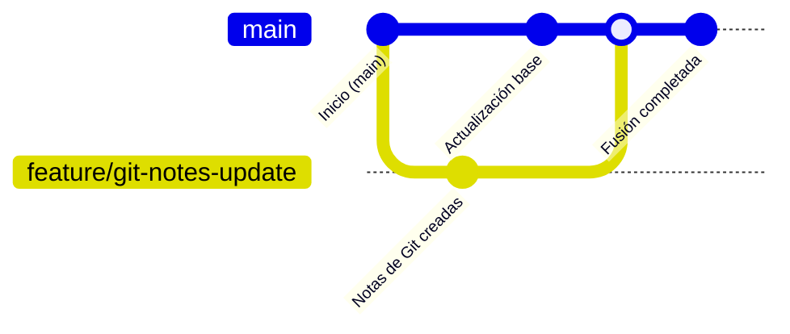

# ⚠️ Conflictos de fusión

---

- [⚠️ Conflictos de fusión](#️-conflictos-de-fusión)
  - [🧹 Eliminar ramas](#-eliminar-ramas)
    - [🌳 Visual de flujo de ramas](#-visual-de-flujo-de-ramas)
    - [💡 Buenas prácticas](#-buenas-prácticas)

---

Los conflictos aparecen cuando **dos ramas modifican las mismas líneas del mismo archivo**.

Git marcará los conflictos así dentro del archivo:

```text
<<<<<<< HEAD
versión en main
=======
versión en feature/git-notes-update
>>>>>>> feature/git-notes-update
```

📌 **Solución:**

- Abre el archivo en VSCode, que mostrará botones para:

  - **Accept Current Change** (mantener HEAD)
  - **Accept Incoming Change** (mantener la rama fusionada)
  - **Accept Both Changes** (mantener ambas partes)
- Una vez resuelto, guardas y haces:

  ```bash
  git add archivo-conflictivo
  git commit
  ```

  Esto marca el conflicto como solucionado.

Durante un conflicto, los archivos quedan en estado **Unmerged** hasta que confirmas la resolución.

---
---

## 🧹 Eliminar ramas

```bash
git branch -d nombre-rama
```

Elimina la rama local **si ya fue fusionada**.

```bash
git branch -D nombre-rama
```

⚠️ Elimina la rama **sin verificar si fue fusionada** (usa con cuidado).

---
---

### 🌳 Visual de flujo de ramas



---

### 💡 Buenas prácticas

- Trabaja siempre en ramas separadas (no en `main`).
- Fusiona con commits limpios y mensajes claros.
- Borra ramas ya fusionadas para mantener el repo ordenado.
- Usa `git log --oneline --graph` para visualizar el árbol de commits.

---

<p align="center">
  <a href="git-essentials-notes.md">🔝 <b>Volver al Índice</b> 🔝</a>
</p>

---
