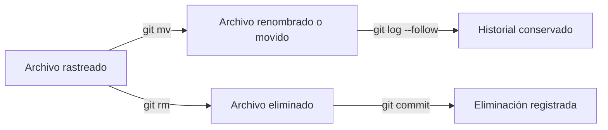

# 📂 TRACKING PATH CHANGES

Git no solo guarda el contenido de tus archivos, también rastrea **su ubicación y nombre** dentro del proyecto.
Estos comandos te permiten mover, renombrar o eliminar archivos sin perder su historial de versiones.


---

- [📂 TRACKING PATH CHANGES](#-tracking-path-changes)
  - [🗑️ `git rm` — Eliminar archivos del proyecto](#️-git-rm--eliminar-archivos-del-proyecto)
  - [🚚 `git mv` — Renombrar o mover archivos](#-git-mv--renombrar-o-mover-archivos)
    - [🧾 `git log --stat -M` — Ver historial con archivos movidos o renombrados](#-git-log---stat--m--ver-historial-con-archivos-movidos-o-renombrados)
  - [🧭 Flujo visual](#-flujo-visual)
  - [💡 Buenas prácticas](#-buenas-prácticas)

---

## 🗑️ `git rm` — Eliminar archivos del proyecto

```bash
git rm archivo.txt
```

📌 **Qué hace:**

- Elimina el archivo **del directorio de trabajo** y del **área de staging**.
- Al hacer `git commit`, la eliminación quedará registrada en el historial.

💡 **Ejemplo:**

```bash
git rm old-notes.md
git commit -m "Elimina archivo obsoleto"
```

🧩 **Flags útiles:**

| Flag       | Acción                                                                                |
| ---------- | ------------------------------------------------------------------------------------- |
| `--cached` | Elimina el archivo solo del control de versiones, **pero lo conserva** en tu carpeta. |
| `--force`  | Obliga la eliminación incluso si hay cambios sin guardar. ⚠️                          |

💬 **Ejemplo práctico:**

```bash
git rm --cached imagen.png   # Git deja de rastrear la imagen, pero no la borra.
```

---
---

## 🚚 `git mv` — Renombrar o mover archivos

```bash
git mv nombre-viejo.txt nombre-nuevo.txt
```

📌 **Qué hace:**

- Cambia el nombre o ubicación del archivo.
- Prepara automáticamente el cambio para el próximo commit.

💡 **Ejemplo de movimiento:**

```bash
git mv docs/apuntes.md notas/git-apuntes.md
git commit -m "Reorganiza apuntes en nueva carpeta"
```

👉 Git detecta automáticamente el cambio de ruta o nombre y mantiene el historial del archivo.

---

### 🧾 `git log --stat -M` — Ver historial con archivos movidos o renombrados

```bash
git log --stat -M
```

📌 **Qué hace:**

- Muestra los commits con estadísticas de archivos modificados, renombrados o movidos.
- La opción `-M` indica a Git que **detecte movimientos o renombres** para conservar el historial.

💡 **Ejemplo:**

```bash
git log --follow notas/git-apuntes.md
```

👉 Muestra el historial completo del archivo, incluso si cambió de nombre.

| Comando                      | Qué muestra                                                                 | Cuándo usarlo                                                     |
| ---------------------------- | --------------------------------------------------------------------------- | ----------------------------------------------------------------- |
| `git log --stat -M`          | Todos los commits del repo con estadísticas globales, detectando renombres. | Cuando quieres ver *qué cambió en general*.                       |
| `git log --follow <archivo>` | Solo los commits relacionados con un archivo, siguiendo sus renombres.      | Cuando quieres seguir el historial *de un archivo en particular*. |

---

💡 **Analogía rápida:**
Piensa que `--stat` es como el “resumen de actividad de todo el grupo”,
y `--follow` es el “historial personal de un solo integrante”.

---
---

## 🧭 Flujo visual



---

## 💡 Buenas prácticas

- Usa `git mv` en lugar de mover archivos manualmente (mantiene el historial limpio).
- Si eliminaste o moviste manualmente, usa `git add -A` para que Git registre el cambio.
- Usa `git log --follow archivo` para verificar la trazabilidad completa de un archivo renombrado.
- Evita usar `git rm --force` a menos que estés absolutamente seguro.

---

<p align="center">
  <a href="git-essentials-notes.md">🔝 <b>Volver al Índice</b> 🔝</a>
</p>

---
