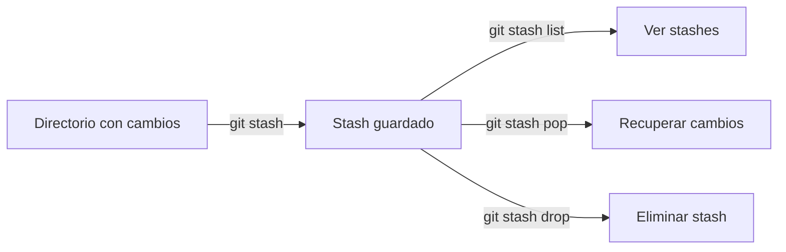

# 🗂️ TEMPORARY COMMITS — Stash

💾 —esta parte es clave porque te salva cuando tienes cambios sin terminar y necesitas cambiar de rama sin perderlos.

El “stash” es como una **mochila temporal** donde guardas cambios para no perderlos ni tener que hacer commit aún.
Sirve cuando necesitas cambiar de rama o actualizarte, pero tienes trabajo en curso.


---

- [🗂️ TEMPORARY COMMITS — Stash](#️-temporary-commits--stash)
  - [📦 `git stash` — Guardar cambios temporalmente](#-git-stash--guardar-cambios-temporalmente)
  - [📜 `git stash list` — Ver la lista de stashes](#-git-stash-list--ver-la-lista-de-stashes)
  - [📤 `git stash pop` — Recuperar cambios](#-git-stash-pop--recuperar-cambios)
  - [🗑️ `git stash drop` — Eliminar stashes](#️-git-stash-drop--eliminar-stashes)
  - [🧭 Flujo visual de Stash](#-flujo-visual-de-stash)
  - [💡 Buenas prácticas](#-buenas-prácticas)

---

## 📦 `git stash` — Guardar cambios temporalmente

```bash
git stash
```

📌 **Qué hace:**

- Guarda los cambios de tu directorio de trabajo y de staging en una “pila” (stack) de stashes.
- Deja tu directorio limpio (como si acabases de hacer `git checkout` sin cambios).

💡 Útil cuando:

- Estás en una rama y necesitas cambiar a otra sin hacer commit.
- Vas a actualizar (`pull`) pero no quieres que tus cambios entren en conflicto todavía.

---
---

## 📜 `git stash list` — Ver la lista de stashes

```bash
git stash list
```

📌 **Qué hace:**

- Muestra todas las entradas guardadas en tu “mochila” de stashes.
- Cada entrada tiene un índice: `stash@{0}`, `stash@{1}`, etc.

Ejemplo de salida:

```bash
stash@{0}: WIP on feature-x: 9f3c2a1 agrega configuración inicial
stash@{1}: WIP on main: 7a5d6e4 corrige README
```

---
---

## 📤 `git stash pop` — Recuperar cambios

```bash
git stash pop
```

📌 **Qué hace:**

- Aplica el último stash guardado a tu directorio de trabajo.
- Borra ese stash de la lista.

💡 Si quieres aplicarlo pero **mantenerlo** en la lista:

```bash
git stash apply
```

---
---

## 🗑️ `git stash drop` — Eliminar stashes

```bash
git stash drop stash@{0}
```

📌 **Qué hace:**

- Borra la entrada específica de la lista de stashes.

Para borrar todos:

```bash
git stash clear
```

---

## 🧭 Flujo visual de Stash



---

## 💡 Buenas prácticas

- Usa `git stash` solo para cambios temporales, no como sistema de commits.
- Nombra tus stashes para identificarlos mejor:

  ```bash
  git stash push -m "Trabajo parcial en login"
  ```

- Antes de aplicar un stash, asegúrate de estar en la rama correcta.

- Recuerda: `pop` aplica y borra, `apply` aplica y mantiene en la lista.

---

✅ Con este tema podemos dominar el uso de **stash** para guardar y recuperar trabajo sin necesidad de commits.

---

<p align="center">
  <a href="git-essentials-notes.md">🔝 <b>Volver al Índice</b> 🔝</a>
</p>

---
