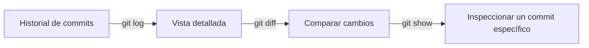

# 🔎 INSPECT & COMPARE

Estos comandos sirven para **examinar el historial** y **comparar cambios** entre commits, archivos y ramas. Son tus “lupas” para entender qué pasó en tu repo en cada momento.


---

- [🔎 INSPECT \& COMPARE](#-inspect--compare)
  - [📝 `git log` — Ver historial de commits](#-git-log--ver-historial-de-commits)
  - [🧩 `git diff` — Comparar diferencias](#-git-diff--comparar-diferencias)
  - [👁️ `git show` — Ver detalles de un commit](#️-git-show--ver-detalles-de-un-commit)
  - [🧭 Flujo visual](#-flujo-visual)
  - [💡 Buenas prácticas](#-buenas-prácticas)

---

## 📝 `git log` — Ver historial de commits

```bash
git log
```

📌 **Qué hace:**

- Muestra la lista de commits de la rama actual en orden inverso (el más reciente primero).
- Incluye hash del commit, autor, fecha y mensaje.

🧩 **Variantes útiles:**

| Comando                    | Resultado                                                      |
| -------------------------- | -------------------------------------------------------------- |
| `git log --oneline`        | Vista compacta, un commit por línea.                           |
| `git log --graph`          | Vista gráfica de ramas y merges.                               |
| `git log --decorate`       | Muestra nombres de ramas y tags junto al commit.               |
| `git log --follow archivo` | Historial completo de un archivo, incluso si cambió de nombre. |

💡 **Combínalos:**

```bash
git log --oneline --graph --decorate --all
```

👉 Vista corta, con ramas, tags y todo el historial.

---
---

## 🧩 `git diff` — Comparar diferencias

Compara el contenido de archivos en distintos estados.

| Comando                    | Qué compara                                            |
| -------------------------- | ------------------------------------------------------ |
| `git diff`                 | Cambios en tu directorio de trabajo **no preparados**. |
| `git diff --staged`        | Cambios en el *staging area* frente al último commit.  |
| `git diff ramaA..ramaB`    | Diferencias entre dos ramas.                           |
| `git diff <hash1> <hash2>` | Diferencias entre dos commits.                         |

💬 **Ejemplo práctico:**

```bash
git diff main..feature/login
```

👉 Muestra los cambios entre `main` y la rama `feature/login`.

---
---

## 👁️ `git show` — Ver detalles de un commit

```bash
git show <hash-commit>
```

📌 **Qué hace:**

- Muestra un commit específico con autor, fecha, mensaje y cambios aplicados.
- Útil para revisar **qué exactamente se cambió** en un commit puntual.

💡 También puedes usarlo para tags o ramas:

```bash
git show v1.0.0
```

👉 Muestra la información del commit donde está ese tag.

---

## 🧭 Flujo visual



---

## 💡 Buenas prácticas

- Usa `git log --oneline --graph` antes de reescribir o resetear para entender el árbol.
- Combina `git diff` con `--staged` antes de hacer commit para revisar exactamente qué vas a guardar.
- Usa `git show <hash>` cuando necesites confirmar detalles de un commit pasado.
- Si quieres exportar diferencias, puedes hacer:

  ```bash
  git diff > cambios.patch
  ```
  
---

<p align="center">
  <a href="git-essentials-notes.md">🔝 <b>Volver al Índice</b> 🔝</a>
</p>

---
