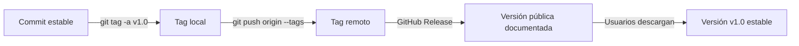

# 📘 TAGS & RELEASES

Las **etiquetas** (*tags*) se usan para marcar puntos específicos del historial del repositorio, generalmente para **versionar** o señalar commits importantes como versiones estables o entregas finales.
En GitHub, estas etiquetas se pueden usar para crear **releases**, con notas de versión o archivos de publicación.


---

- [📘 TAGS \& RELEASES](#-tags--releases)
  - [🏷️ Concepto y tipos de tags](#️-concepto-y-tipos-de-tags)
    - [🔹 ¿Qué es un tag?](#-qué-es-un-tag)
    - [🔹 Tipos de etiquetas](#-tipos-de-etiquetas)
    - [🔹 Asignar etiquetas a commits específicos](#-asignar-etiquetas-a-commits-específicos)
    - [🔹 Ver etiquetas existentes](#-ver-etiquetas-existentes)
    - [🔹 Mostrar información detallada del tag](#-mostrar-información-detallada-del-tag)
    - [🔹 Ver asociaciones entre tags y commits](#-ver-asociaciones-entre-tags-y-commits)
  - [🌐 Gestión remota y manipulación de tags](#-gestión-remota-y-manipulación-de-tags)
    - [📤 Subir tags al repositorio remoto](#-subir-tags-al-repositorio-remoto)
    - [🗑️ Eliminar etiquetas](#️-eliminar-etiquetas)
      - [Localmente:](#localmente)
      - [En remoto:](#en-remoto)
    - [🔁 Reasignar un tag](#-reasignar-un-tag)
  - [🚀 Releases en GitHub y Buenas prácticas](#-releases-en-github-y-buenas-prácticas)
    - [📦 Crear un Release en GitHub](#-crear-un-release-en-github)
    - [🧠 Flujo visual — Tags \& Releases](#-flujo-visual--tags--releases)
    - [💡 Buenas prácticas](#-buenas-prácticas)

## 🏷️ Concepto y tipos de tags

### 🔹 ¿Qué es un tag?

Un **tag** es una referencia inmutable a un commit específico.
Sirve como marcador o “foto” dentro del historial de Git.
Ideal para marcar **versiones estables** o **puntos clave del proyecto**.

💡 *Ejemplo:*

> Al terminar una funcionalidad completa y estable, puedes crear un tag `v1.0` para marcar esa versión.

---

### 🔹 Tipos de etiquetas

| Tipo                     | Descripción                                                                | Ejemplo                                        |
| ------------------------ | -------------------------------------------------------------------------- | ---------------------------------------------- |
| **Ligera (lightweight)** | Solo apunta al hash del commit, sin información extra.                     | `git tag v1.0`                                 |
| **Anotada (annotated)**  | Contiene metadatos (autor, fecha, mensaje). Ideal para versiones públicas. | `git tag -a v1.0 -m "Versión estable inicial"` |

📌 **Recomendación:**
Siempre usa tags anotados (`-a`) para versiones oficiales o públicas.

---

### 🔹 Asignar etiquetas a commits específicos

```bash
git tag -a v1.0.1 <hash-commit> -m "Hotfix versión 1.0.1"
```

💬 Esto marca un commit anterior con una etiqueta, aunque no sea el más reciente.

---

### 🔹 Ver etiquetas existentes

```bash
git tag
```

📋 Lista todas las etiquetas locales.

---

### 🔹 Mostrar información detallada del tag

```bash
git show v1.0
```

📌 Muestra el commit asociado, el mensaje del tag, autor, fecha y contenido del cambio.

---

### 🔹 Ver asociaciones entre tags y commits

```bash
git show-ref --tags
```

📌 Lista cada tag junto al hash del commit correspondiente.
Perfecto para ubicar de forma rápida qué commit está marcado por cada etiqueta.

---

## 🌐 Gestión remota y manipulación de tags

---

### 📤 Subir tags al repositorio remoto

```bash
git push origin --tags
```

📌 Sube **todos los tags** locales al remoto.

O, si quieres subir uno específico:

```bash
git push origin v1.0
```

---

### 🗑️ Eliminar etiquetas

#### Localmente:

```bash
git tag -d v1.0
```

#### En remoto:

Primero elimina el tag local y luego el remoto:

```bash
git push origin --delete v1.0
```

O alternativamente:

```bash
git push origin :refs/tags/v1.0
```

💡 Si el tag ya fue subido, recuerda borrarlo en ambos lugares para mantener sincronía.

---

### 🔁 Reasignar un tag

Si etiquetaste el commit incorrecto:

```bash
git tag -d v1.0
git tag -a v1.0 <hash-correcto> -m "Etiqueta corregida"
git push origin -f v1.0
```

⚠️ `-f` (force) es necesario si el tag ya existía en el remoto.
Úsalo con cuidado para no sobrescribir versiones ya distribuidas.

---

## 🚀 Releases en GitHub y Buenas prácticas

---

### 📦 Crear un Release en GitHub

1. Ve a la pestaña **Releases** en tu repositorio.
2. Haz clic en **“Draft a new release”**.
3. Elige un tag existente o crea uno nuevo.
4. Agrega título, descripción y notas de cambios (Changelog).
5. Publica el Release.

💡 Los Releases pueden incluir binarios, ejecutables o documentación específica de esa versión.

---

### 🧠 Flujo visual — Tags & Releases



---

### 💡 Buenas prácticas

✅ Usa **versionado semántico (SemVer)**:
`vMAJOR.MINOR.PATCH`
Ejemplo:

* `v1.0.0` → primera versión estable.
* `v1.1.0` → nueva funcionalidad sin romper compatibilidad.
* `v1.1.1` → corrección menor o hotfix.

✅ Crea tags **anotados** (`-a`) para mantener información completa.
✅ Revisa que tu `main` esté estable antes de etiquetar.
✅ Añade un archivo **CHANGELOG.md** con los cambios importantes de cada versión.
✅ No borres tags antiguos, son parte del historial del proyecto.
✅ Usa tags también para **documentación**, **entregas de prácticas** o **checkpoints** en proyectos académicos.

---

✅ Con esto ya dominas el uso **profesional de etiquetas y releases**, desde la creación local hasta su publicación en GitHub.

---

<p align="center">
  <a href="git-essentials-notes.md">🔝 <b>Volver al Índice</b> 🔝</a>
</p>

---
