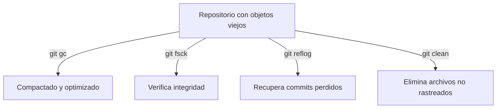

# 🧹 MAINTENANCE & OPTIMIZATION

Git guarda todo: commits, objetos, ramas, referencias… con el tiempo esto puede generar **archivos innecesarios** o referencias obsoletas.
Estos comandos te ayudan a **mantener tu repositorio limpio, liviano y funcional.**


---

- [🧹 MAINTENANCE \& OPTIMIZATION](#-maintenance--optimization)
  - [🧰 `git gc` — Garbage Collector (compacta y optimiza)](#-git-gc--garbage-collector-compacta-y-optimiza)
  - [🩺 `git fsck` — Verificación de integridad](#-git-fsck--verificación-de-integridad)
  - [🧭 `git reflog` — Historial de movimientos (el salvavidas)](#-git-reflog--historial-de-movimientos-el-salvavidas)
  - [🧼 `git clean` — Limpieza de archivos no rastreados](#-git-clean--limpieza-de-archivos-no-rastreados)
  - [🧩 Flujo visual de mantenimiento](#-flujo-visual-de-mantenimiento)
  - [💡 Buenas prácticas de mantenimiento](#-buenas-prácticas-de-mantenimiento)

---

## 🧰 `git gc` — Garbage Collector (compacta y optimiza)

```bash
git gc
```

📌 **Qué hace:**

* “Empaca” objetos sueltos (commits, blobs, etc.) en archivos más compactos.
* Borra datos temporales que ya no se usan.
* Reduce el tamaño del repositorio y mejora el rendimiento.

💡 Git ejecuta este proceso automáticamente de vez en cuando, pero puedes forzarlo manualmente.

⚙️ **Modo agresivo (más profundo):**

```bash
git gc --aggressive --prune=now
```

👉 Reorganiza toda la base de datos interna de Git y elimina todo lo que ya no se referencia.
⚠️ Puede tardar varios minutos en repos grandes.

---

## 🩺 `git fsck` — Verificación de integridad

```bash
git fsck
```

📌 **Qué hace:**

* Verifica la integridad de tu repositorio.
* Detecta objetos dañados o referencias perdidas.

💡 Úsalo si sospechas de corrupción de datos o errores en `.git/`.

🔍 **Ver objetos huérfanos (dangling commits):**

```bash
git fsck --lost-found
```

👉 Muestra commits o blobs sin referencia a ninguna rama, útiles para recuperar trabajo perdido.

---

## 🧭 `git reflog` — Historial de movimientos (el salvavidas)

```bash
git reflog
```

📌 **Qué hace:**

* Muestra todos los movimientos de HEAD: cambios de rama, resets, merges, rebases, etc.
* Te permite **recuperar commits eliminados** incluso después de un `reset --hard`.

💬 **Ejemplo de uso:**

```bash
git reflog
# muestrará algo como:
# a7c9b1d HEAD@{0}: reset: moving to HEAD~1
# 1f2d9e0 HEAD@{1}: commit: agrega archivo de configuración
```

👉 Puedes restaurar un commit perdido así:

```bash
git checkout <hash-commit-perdido>
# o crear una rama para recuperarlo:
git switch -c recuperacion <hash-commit-perdido>
```

💡 Es uno de los comandos más útiles para “deshacer el desastre”.

---

## 🧼 `git clean` — Limpieza de archivos no rastreados

```bash
git clean -n
```

📌 Muestra qué archivos **no rastreados (untracked)** serían eliminados.
No borra nada todavía.

```bash
git clean -f
```

📌 Elimina los archivos no rastreados (sin commit, sin staging).

💡 **Parámetros útiles:**

| Flag | Acción                                                    |
| ---- | --------------------------------------------------------- |
| `-f` | Forzar eliminación.                                       |
| `-d` | Incluir directorios no rastreados.                        |
| `-x` | Borra también los archivos ignorados por `.gitignore`. ⚠️ |
| `-i` | Modo interactivo (elige qué borrar).                      |

🔍 **Ejemplo completo:**

```bash
git clean -fd
```

👉 Elimina todo lo no rastreado: carpetas y archivos, dejando tu repo como nuevo.

---

## 🧩 Flujo visual de mantenimiento



---

## 💡 Buenas prácticas de mantenimiento

✅ Ejecuta `git gc` al menos una vez por mes en proyectos grandes.
✅ Usa `git fsck` después de fallos de energía o errores en Git.
✅ Haz `git reflog` si perdiste commits por accidente.
✅ Ejecuta `git clean -n` antes de borrar, para ver qué eliminarás.
✅ No ejecutes `--aggressive` muy seguido, solo en repos con mucho historial.

---

✅ Con esto dominas el mantenimiento completo de un repositorio:
cómo mantenerlo rápido, íntegro y limpio, **sin perder nada importante.**

---

<p align="center">
  <a href="git-essentials-notes.md">🔝 <b>Volver al Índice</b> 🔝</a>
</p>

---
