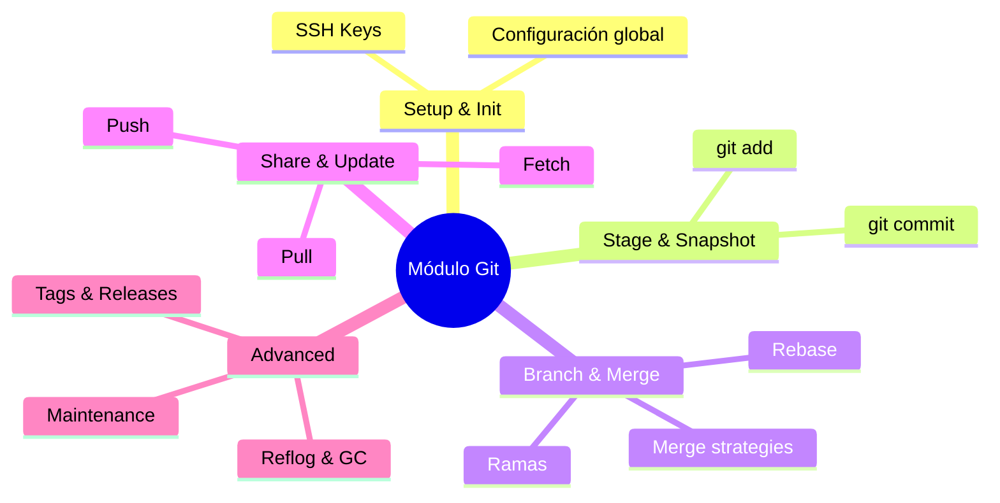

# 💫 FINAL BLOCK — Cierre del Módulo Git: Buenas prácticas y preparación profesional


---

- [💫 FINAL BLOCK — Cierre del Módulo Git: Buenas prácticas y preparación profesional](#-final-block--cierre-del-módulo-git-buenas-prácticas-y-preparación-profesional)
  - [🎯 Objetivo de este cierre](#-objetivo-de-este-cierre)
  - [🧭 1. Estructura profesional de repositorios](#-1-estructura-profesional-de-repositorios)
  - [🧱 2. Commits profesionales](#-2-commits-profesionales)
  - [🧰 3. Seguridad y respaldo](#-3-seguridad-y-respaldo)
  - [🧹 4. Limpieza y mantenimiento](#-4-limpieza-y-mantenimiento)
  - [💼 5. Mostrar tu trabajo (portafolio técnico)](#-5-mostrar-tu-trabajo-portafolio-técnico)
  - [🚀 6. Preparar transición a la siguiente sección: GitHub Tools](#-6-preparar-transición-a-la-siguiente-sección-github-tools)
  - [🧠 Diagrama resumen del módulo Git](#-diagrama-resumen-del-módulo-git)
  - [💬 Reflexión final](#-reflexión-final)

---

## 🎯 Objetivo de este cierre

Consolidar todo lo aprendido sobre Git y dejar tu entorno listo para la siguiente fase:
**colaborar, compartir y presentar proyectos profesionales** en GitHub.

## 🧭 1. Estructura profesional de repositorios

💡 **Buenas prácticas de organización**

| Elemento          | Descripción                                                            | Ejemplo                               |
| ----------------- | ---------------------------------------------------------------------- | ------------------------------------- |
| `README.md`       | Portada del proyecto. Explica qué hace, cómo usarlo y cómo contribuir. | Breve, con secciones claras y badges. |
| `.gitignore`      | Evita subir archivos innecesarios.                                     | Logs, dependencias, claves privadas.  |
| `LICENSE`         | Define permisos de uso.                                                | MIT, GPL, CC, etc.                    |
| `CHANGELOG.md`    | Historial de cambios por versión.                                      | Usar formato SemVer.                  |
| `CONTRIBUTING.md` | Guía para colaboradores.                                               | Explica cómo hacer PRs y commits.     |

💬 *Un repo sin documentación es como una casa sin puertas: nadie sabe por dónde entrar.*

## 🧱 2. Commits profesionales

Usa **mensajes breves, consistentes y en presente**:

| Tipo de cambio  | Ejemplo de mensaje                          |
| --------------- | ------------------------------------------- |
| Nueva función   | `feat: agrega sistema de autenticación`     |
| Corrección      | `fix: corrige bug al crear usuario`         |
| Documentación   | `docs: actualiza guía de instalación`       |
| Refactorización | `refactor: simplifica lógica de validación` |
| Estilo          | `style: ajusta formato de código`           |
| Tests           | `test: agrega pruebas de login`             |

💡 Este formato (tipo: descripción) es estándar en equipos grandes y compatible con **Conventional Commits**.

## 🧰 3. Seguridad y respaldo

* **SSH**: usa llaves seguras en lugar de contraseñas.
* **Forks**: trabaja en copias para no comprometer la rama principal.
* **Branches protegidas**: en GitHub, protege `main` para exigir revisiones antes de fusionar.
* **Respaldos locales**: clona tus repos críticos en una segunda ubicación o disco externo.

## 🧹 4. Limpieza y mantenimiento

Repite cada cierto tiempo:

```bash
git fetch --prune
git gc
git fsck
git reflog expire --expire=90.days.ago --all
```

📌 Con esto mantienes tu repositorio **optimizado y sin referencias viejas**.

## 💼 5. Mostrar tu trabajo (portafolio técnico)

Para esta parte te tocará personalizar tu perfil de GitHub!, puedes verlo en las siguientes notas [github-essentials-notes.md](Ruta "Notas del curso enfocado a GitHub!")

* Crea un repositorio personal llamado **`<tu-usuario>`** en GitHub (por ejemplo, `Ssail-1`).
* Personalízalo con un **README.md de perfil** (mostrará tu presentación en tu perfil público).
* Incluye:

  * Breve biografía y objetivos.
  * Proyectos destacados.
  * Badges de tecnologías (desde [shields.io](https://shields.io/)).
  * Estadísticas y enlaces a tus redes profesionales.

💬 *Tu perfil de GitHub es tu nuevo currículum técnico.*

## 🚀 6. Preparar transición a la siguiente sección: GitHub Tools

Esta parte no es necesaría al 100%, en [github-essentials-notes.md](Ruta "Notas del curso enfocado a GitHub!") podrás descubir como configurar SSH que es lo unico que hace falta en este archivo, pero si te recomiendo tener una cuenta secundaria de github :D.

Antes de pasar a GitHub, asegúrate de tener:

✅ SSH configurado y probado.
✅ Tu cuenta principal ([`Ssail-1`](https://github.com/Ssail-1 "GitHub principal de Ssail")) como portfolio.
✅ Tu cuenta secundaria ([`decktSsail`](https://github.com/decktSsail "GitHub secundario de Ssail")) para practicar forks y PRs.
✅ Un repositorio con el que puedas experimentar como  ([`PlatziNotes`](https://github.com/Ssail-1/PlatziNotes "Repositorio de documentacion y notas de los cursos de Platzi")) actualizado con todo lo aprendido.  
✅ Y claro conocimiento de los siguientes comandos:

* `git clone`, `git pull`, `git push`, `git fetch`
* `git add`, `git commit`, `git status`, `git diff`
* `git branch`, `git switch`, `git merge`, `git rebase`
* `git tag`, `git gc`, `git reflog`, `git clean`

De los cuales si tienes dudas, puedes regresar aqui siempre!

## 🧠 Diagrama resumen del módulo Git



---

## 💬 Reflexión final

> “Dominar Git no es solo saber comandos, es **entender la historia del código**.”
> Cada commit cuenta una parte de ti, de tus errores, tus mejoras y tus logros.
> Desde hoy, cada `git add` es una semilla de tu progreso 🌱.

[🔗 Repositorio principal del proyecto](https://github.com/Ssail-1/PlatziNotes)

---

✅ **Con esto termina el módulo de Git.**
El entorno está limpio, el conocimiento consolidado y estamos listos para dar el salto a la **Sección II: GitHub — Colaboración y Herramientas en la Nube.**

---

<p align="center">
  <a href="git-essentials-notes.md">🔝 <b>Volver al Índice</b> 🔝</a>

  📘 [Volver al README del Curso](../README.md)  
  📗 [Ir a Notas de GitHub](../github-notes/github-essentials-notes.md)

</p>

---
