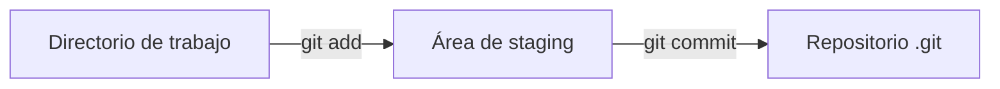

# 📂 ¿Cómo se crean y agregan archivos a Git?

Una vez que inicializas un repositorio con `git init`, puedes empezar a crear archivos y agregarlos al control de versiones.


---

- [📂 ¿Cómo se crean y agregan archivos a Git?](#-cómo-se-crean-y-agregan-archivos-a-git)
  - [📖 Flujo visual básico](#-flujo-visual-básico)
  - [✍️ Creación de archivos](#️-creación-de-archivos)
  - [🔎 Verificar estado](#-verificar-estado)
  - [➕ Agregar archivos al ***staging area***](#-agregar-archivos-al-staging-area)
  - [🗑️ Quitar archivos del *staging area*](#️-quitar-archivos-del-staging-area)
  - [💾 Guardar cambios en el repositorio](#-guardar-cambios-en-el-repositorio)

---

## 📖 Flujo visual básico



---
---

## ✍️ Creación de archivos

Puedes crear archivos con tu editor de preferencia, por ejemplo:

```bash
nano notas.md
```

📌 Luego confirmas su existencia con:

```bash
ls
```

---
---

## 🔎 Verificar estado

```bash
git status
```

📌 **Qué hace:**

- Muestra qué archivos están sin seguimiento (*untracked*).
- Qué archivos ya están en el área de preparación (*staging*).
- En qué rama te encuentras.

👉 Es tu **mapa de situación** antes de cualquier commit.

---
---

## ➕ Agregar archivos al ***staging area***

```bash
git add nombre_archivo.txt
```

📌 **Qué hace:**

- Mueve el archivo al área de preparación (*staging*).
- Indica que ese archivo estará listo para el próximo commit.

> [!important]
> 🛠️ Variantes:
> - `git add .` → agrega todos los archivos del directorio actual.
> - `git add -A` → agrega todos los cambios, incluyendo eliminaciones y renombres.
>

---
---

## 🗑️ Quitar archivos del *staging area*

```bash
git reset nombre_archivo.txt
```

👉 Saca el archivo del *staging area*, pero conserva los cambios en tu directorio de trabajo.

```bash
git rm --cached nombre_archivo.txt
```

👉 Similar a `reset`, **pero** pensado para remover un archivo del control de versiones (queda en tu carpeta, pero Git lo ignora).

```bash
git rm --force nombre_archivo.txt
```

👉 Borra el archivo tanto del *staging area* como del directorio de trabajo.

---
---

## 💾 Guardar cambios en el repositorio

```bash
git commit -m "Descripción clara del cambio"
```

📌 **Qué hace:**

- Crea un *snapshot* de los archivos en staging.
- Registra ese cambio en el historial del proyecto.

👉 Si olvidas `-m`, se abrirá tu editor configurado (Vim, Nano, etc.) para escribir el mensaje.

---

💡 **Buenas prácticas**

- Usa mensajes de commit descriptivos (ej. `"Agrego sección Setup & Init"`).
- No subas archivos binarios grandes ni temporales (usa `.gitignore`).
- Antes de cada commit, revisa siempre con `git status` qué estás incluyendo.

---

<p align="center">
  <a href="git-essentials-notes.md">🔝 <b>Volver al Índice</b> 🔝</a>
</p>

---
