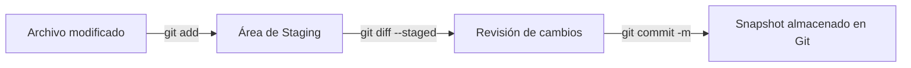

# 📸 STAGE & SNAPSHOT

Trabajar con **instantáneas (snapshots)** en Git significa preparar, revisar y guardar el estado exacto de tus archivos en un momento determinado.


---

- [📸 STAGE \& SNAPSHOT](#-stage--snapshot)
  - [🔍 `git status` — Verificar el estado del repositorio](#-git-status--verificar-el-estado-del-repositorio)
  - [➕ `git add` — Preparar cambios para un commit](#-git-add--preparar-cambios-para-un-commit)
  - [🧾 `git diff` — Comparar diferencias](#-git-diff--comparar-diferencias)
  - [💾 `git commit` — Crear una instantánea](#-git-commit--crear-una-instantánea)
  - [🔁 `git commit --amend` — Modificar el último commit](#-git-commit---amend--modificar-el-último-commit)
    - [💡 Buenas prácticas](#-buenas-prácticas)
    - [🧭 Flujo visual de Stage → Snapshot](#-flujo-visual-de-stage--snapshot)

---

## 🔍 `git status` — Verificar el estado del repositorio

```bash
git status
```

📌 **Qué hace:**

- Muestra los archivos **modificados**, **nuevos**, o **eliminados** en tu directorio.
- Indica qué está **en el área de staging** y qué no.
- Te dice en qué **rama** estás trabajando.

💡 **Ejemplo práctico:**

```bash
git status
# On branch feature/git-notes-update
# Changes not staged for commit:
#   modified: git-and-gitHub-notes.md
```

👉 Así sabes si algo está pendiente antes de hacer `add` o `commit`.

---
---

## ➕ `git add` — Preparar cambios para un commit

```bash
git add archivo.txt
```

📌 **Qué hace:**

- Agrega el archivo (o cambios específicos) al área de *staging*.
- Permite que esos archivos sean incluidos en el próximo *commit*.

🧩 **Variantes útiles:**

| Comando      | Acción                                                            |
| ------------ | ----------------------------------------------------------------- |
| `git add .`  | Agrega todos los archivos del directorio actual.                  |
| `git add -A` | Agrega **todos los cambios** (incluso eliminaciones y renombres). |
| `git add -p` | Agrega cambios por fragmentos (*porciones del archivo*).          |

💡 **Tips:**

- Usa `-p` si quieres elegir partes del archivo para agregar.
- Revisa siempre con `git status` antes de confirmar.

---
---

## 🧾 `git diff` — Comparar diferencias

📍 **Antes de hacer `git add`:**

```bash
git diff
```

Muestra los cambios **que aún no han sido preparados** (*unstaged*).

📍 **Después de hacer `git add`:**

```bash
git diff --staged
```

Muestra los cambios **ya en staging** que serán incluidos en el siguiente *commit*.

💬 **Explicación técnica:**

- `diff` → diferencia entre versiones.
- `--staged` → compara el staging con el último *commit*.

---
---

## 💾 `git commit` — Crear una instantánea

```bash
git commit -m "Descripción del cambio"
```

📌 **Qué hace:**

- Guarda los archivos del staging como una *snapshot* en el historial del repositorio.
- Crea un punto de restauración seguro al que puedes volver con `git checkout`.

💡 **Atajos:**

| Comando                    | Significado                                                         |
| -------------------------- | ------------------------------------------------------------------- |
| `git commit -m "mensaje"`  | Commit con mensaje corto.                                           |
| `git commit -am "mensaje"` | Añade y hace commit **solo de archivos ya rastreados** (no nuevos). |

---
---

## 🔁 `git commit --amend` — Modificar el último commit

```bash
git commit --amend -m "Nuevo mensaje actualizado"
```

📌 Corrige el mensaje o agrega archivos que olvidaste.

⚠️ **Importante:**
Solo úsalo si **aún no hiciste push**, porque reescribe el historial local.

---

### 💡 Buenas prácticas

- Antes de cada `commit`, revisa tu estado con `git status`.
- Usa mensajes de commit **claros y en presente**, ejemplo:

  > `"Agrega explicación de git diff y git commit"`
- Nunca hagas `git add .` a ciegas; revisa los archivos que se incluirán.
- Realiza commits pequeños y frecuentes: facilitan revertir y entender los cambios.

---

### 🧭 Flujo visual de Stage → Snapshot



---

<p align="center">
  <a href="git-essentials-notes.md">🔝 <b>Volver al Índice</b> 🔝</a>
</p>

---
