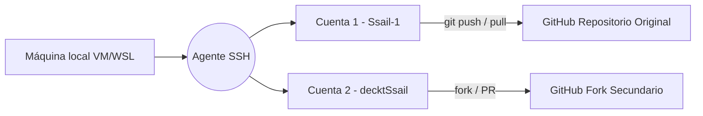
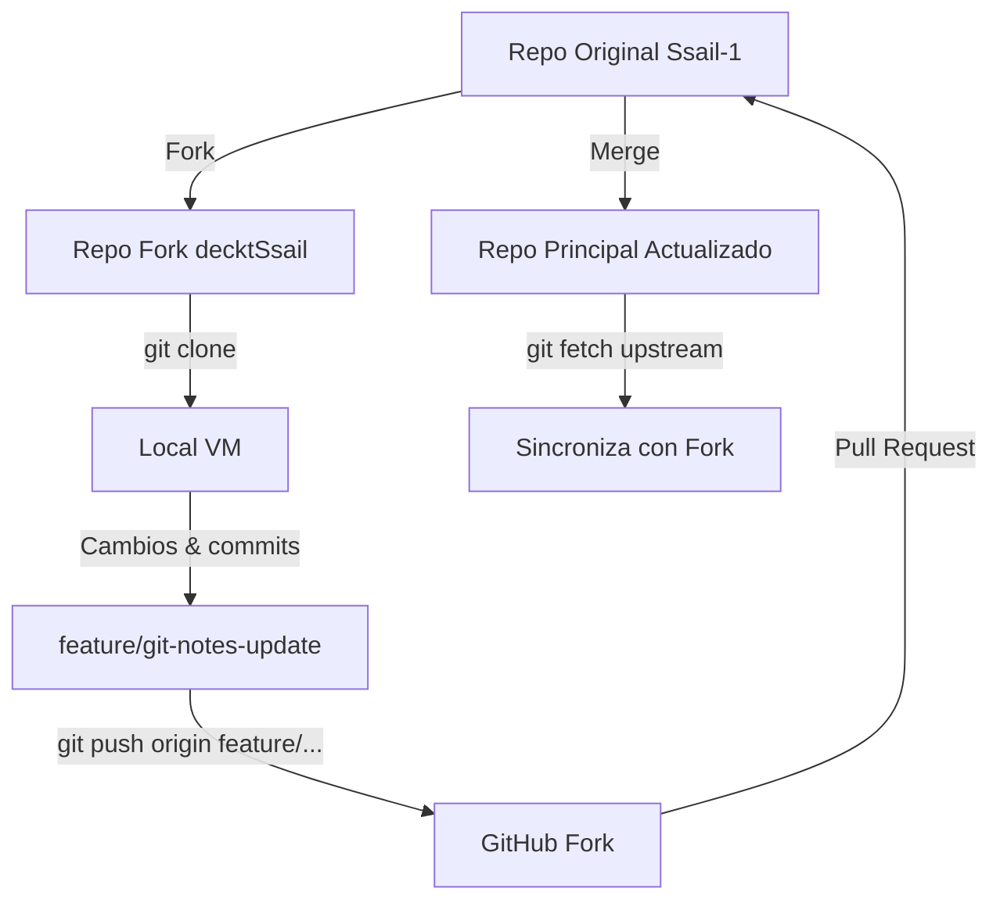
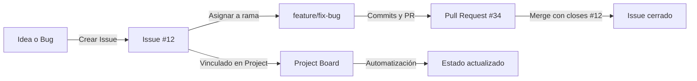

# GitHub Essenttials — Colaboración y Flujo en la Nube.

[](https://github.com/Ssail-1 "GitHub de Ssail-1")
[](https://chat.openai.com "Asistente Noa")
[](https://github.com/Ssail-1/PlatziNotes "Proyecto principal")


## ⚙️ Nota sobre prácticas y configuración

> [!NOTE]  
> 🔄 Para practicar **forks, pull requests y colaboración**, utilicé dos cuentas:  
> `Ssail-1` (perfil principal y portafolio) y `decktSsail` (cuenta de pruebas).  
> 
> Esto me permitió simular un entorno profesional y reforzar el aprendizaje colaborativo real.

---
---

## Índice

📘 [Volver al README del Curso](./README.md)  
📙 [Ir a Notas de Git](./git-essentials-notes.md)

- [GitHub Essenttials — Colaboración y Flujo en la Nube.](#github-essenttials--colaboración-y-flujo-en-la-nube)
  - [⚙️ Nota sobre prácticas y configuración](#️-nota-sobre-prácticas-y-configuración)
  - [Índice](#índice)
  - [🔐 Configuración de SSH en GitHub (una o varias cuentas)](#-configuración-de-ssh-en-github-una-o-varias-cuentas)
    - [⚙️ 1️⃣ Generar tus llaves SSH](#️-1️⃣-generar-tus-llaves-ssh)
    - [🧠 2️⃣ Iniciar el agente SSH](#-2️⃣-iniciar-el-agente-ssh)
    - [🧩 3️⃣ Crear el archivo de configuración `config`](#-3️⃣-crear-el-archivo-de-configuración-config)
    - [🔑 4️⃣ Copiar la llave pública](#-4️⃣-copiar-la-llave-pública)
    - [🧪 5️⃣ Probar la conexión](#-5️⃣-probar-la-conexión)
    - [💡 Recomendaciones finales](#-recomendaciones-finales)
    - [🪄 Resultado visual](#-resultado-visual)
  - [🤝 Forks, Pull Requests y Colaboración en GitHub](#-forks-pull-requests-y-colaboración-en-github)
    - [🍴 1️⃣ Fork: copiar un repositorio para colaborar](#-1️⃣-fork-copiar-un-repositorio-para-colaborar)
      - [🧩 Cómo crear un fork:](#-cómo-crear-un-fork)
    - [🧭 2️⃣ Clonar tu fork localmente](#-2️⃣-clonar-tu-fork-localmente)
    - [🔗 3️⃣ Conectar el repositorio original como *upstream*](#-3️⃣-conectar-el-repositorio-original-como-upstream)
    - [🔄 4️⃣ Mantener sincronizado tu fork](#-4️⃣-mantener-sincronizado-tu-fork)
    - [🧠 5️⃣ Crear una rama de trabajo](#-5️⃣-crear-una-rama-de-trabajo)
    - [🔃 6️⃣ Crear un Pull Request (PR)](#-6️⃣-crear-un-pull-request-pr)
    - [🧩 7️⃣ Revisión de código (*Code Review*)](#-7️⃣-revisión-de-código-code-review)
    - [⚙️ 8️⃣ Fusionar (Merge) el PR](#️-8️⃣-fusionar-merge-el-pr)
    - [🧹 9️⃣ Limpiar ramas](#-9️⃣-limpiar-ramas)
      - [En GitHub:](#en-github)
      - [En local:](#en-local)
    - [🧭 Flujo visual completo](#-flujo-visual-completo)
    - [💡 Buenas prácticas](#-buenas-prácticas)
  - [🧩 Issues y GitHub Projects — Planificación Colaborativa](#-issues-y-github-projects--planificación-colaborativa)
    - [🧠 1️⃣ Issues — seguimiento de tareas o problemas](#-1️⃣-issues--seguimiento-de-tareas-o-problemas)
      - [🧩 Crear un Issue](#-crear-un-issue)
    - [⚙️ 2️⃣ Vincular un Issue con un Pull Request](#️-2️⃣-vincular-un-issue-con-un-pull-request)
    - [🧩 3️⃣ Crear plantillas de Issues](#-3️⃣-crear-plantillas-de-issues)
      - [📁 Estructura](#-estructura)
    - [🗂️ 4️⃣ Projects — planificación visual de trabajo](#️-4️⃣-projects--planificación-visual-de-trabajo)
      - [🧭 Crear un Project](#-crear-un-project)
      - [🧩 Agregar tareas al Project](#-agregar-tareas-al-project)
    - [⚡ 5️⃣ Automatizaciones](#-5️⃣-automatizaciones)
    - [🧩 6️⃣ Flujo visual completo](#-6️⃣-flujo-visual-completo)
    - [💡 Buenas prácticas](#-buenas-prácticas-1)
  - [🧰 Recursos esenciales de Markdown para documentación efectiva](#-recursos-esenciales-de-markdown-para-documentación-efectiva)
    - [🛠️ Herramientas útiles para documentación](#️-herramientas-útiles-para-documentación)
    - [💻 Extensiones para Visual Studio Code](#-extensiones-para-visual-studio-code)
  - [🧩 Creación de una Portada de Perfil en GitHub con Markdown](#-creación-de-una-portada-de-perfil-en-github-con-markdown)
    - [⚙️ ¿Cómo crear el repositorio especial?](#️-cómo-crear-el-repositorio-especial)
    - [🎨 Personalizar el README](#-personalizar-el-readme)
    - [🧠 Herramientas de apoyo](#-herramientas-de-apoyo)
    - [🌟 Buenas prácticas para tu portada](#-buenas-prácticas-para-tu-portada)
    - [Ejemplo de estructura visual](#ejemplo-de-estructura-visual)
  - [9. Uso de wikis](#9-uso-de-wikis)
  - [10. Uso de GitHub Gist](#10-uso-de-github-gist)

---
---

## 🔐 Configuración de SSH en GitHub (una o varias cuentas)


GitHub permite conectarte a tus repositorios sin contraseñas mediante **SSH (Secure Shell)**.
Esto es especialmente útil si manejas varias cuentas (por ejemplo, una principal y otra de pruebas o colaboraciones).

---

### ⚙️ 1️⃣ Generar tus llaves SSH

Abre la terminal y ejecuta:

```bash
ssh-keygen -t ed25519 -C "tu_correo@example.com"
```

💬 Explicación rápida:

- `-t ed25519` → define el tipo de cifrado moderno y más seguro.
- `-C` → añade un comentario (normalmente tu correo, para identificar la llave).

Si usas varias cuentas, crea una llave para cada una cambiando el nombre del archivo al final:

```bash
ssh-keygen -t ed25519 -C "correo_principal@example.com" -f ~/.ssh/id_ed25519_ssail
ssh-keygen -t ed25519 -C "correo_secundario@example.com" -f ~/.ssh/id_ed25519_deckt
```

💡 Esto generará dos pares de archivos:

```
id_ed25519_ssail       ← llave privada
id_ed25519_ssail.pub   ← llave pública
id_ed25519_deckt       ← llave privada secundaria
id_ed25519_deckt.pub   ← llave pública secundaria
```

---

### 🧠 2️⃣ Iniciar el agente SSH

El agente mantiene las llaves activas en memoria para no tener que escribir la contraseña en cada uso:

```bash
eval "$(ssh-agent -s)"
```

Deberías ver un mensaje similar a:

```
Agent pid 1234
```

Agrega tus llaves al agente:

```bash
ssh-add ~/.ssh/id_ed25519_ssail
ssh-add ~/.ssh/id_ed25519_deckt
```

✅ Puedes comprobar que quedaron cargadas con:

```bash
ssh-add -l
```

---

### 🧩 3️⃣ Crear el archivo de configuración `config`

Para alternar entre varias cuentas sin confusión, crea el archivo `~/.ssh/config`:

```bash
nano ~/.ssh/config
```

Y agrega este contenido:

```bash
Host github.com-ssail
  HostName github.com
  User git
  IdentityFile ~/.ssh/id_ed25519_ssail

Host github.com-deckt
  HostName github.com
  User git
  IdentityFile ~/.ssh/id_ed25519_deckt
```

💬 **Explicación:**

- `Host` → alias con el que Git reconocerá la cuenta.
- `HostName` → el dominio real de GitHub.
- `User` → siempre “git”.
- `IdentityFile` → la ruta al archivo de la llave privada correspondiente.

Ahora podrás clonar repos de cada cuenta según el alias:

```bash
git clone git@github.com-ssail:Ssail-1/PlatziNotes.git
git clone git@github.com-deckt:decktSsail/PlatziNotes.git
```

---

### 🔑 4️⃣ Copiar la llave pública

Visualiza el contenido de tu llave **.pub** y cópiala:

```bash
cat ~/.ssh/id_ed25519_ssail.pub
```

Luego en GitHub:

> **Settings → SSH and GPG Keys → New SSH key**

Pega el contenido, asigna un nombre descriptivo (ej. “VM principal” o “Secundaria Deckt”).

Repite el proceso para cada cuenta.

---

### 🧪 5️⃣ Probar la conexión

Ejecuta una prueba para cada configuración:

```bash
ssh -T git@github.com-ssail
ssh -T git@github.com-deckt
```

Deberías recibir una respuesta como:

```
Hi Ssail-1! You've successfully authenticated, but GitHub does not provide shell access.
```

Eso confirma que la conexión SSH está activa y segura.

---

### 💡 Recomendaciones finales

✅ Usa **una sola llave por dispositivo** (dos solo si manejas varias cuentas).
✅ **Nunca compartas tus llaves privadas.**
✅ Si cambias de máquina o reinstalas tu SO, vuelve a agregar las llaves en GitHub.
✅ Respáldalas en un lugar seguro (ej. un USB cifrado).
✅ Usa alias consistentes en el archivo `config` para evitar confusiones.

---

### 🪄 Resultado visual



---

✅ Con esto ya tendrás **autenticación SSH profesional**, ideal para manejar varios repositorios y cuentas en el mismo entorno.
Este es el **método más seguro y flexible** para trabajar en GitHub desde terminal.

---

<p align="center">
  <a href="#índice">🔝 <b>Volver al Índice</b> 🔝</a>
</p>

---
---

## 🤝 Forks, Pull Requests y Colaboración en GitHub


En GitHub, la colaboración se basa en tres pilares:

1. **Forks** → crear una copia del repositorio original.
2. **Pull Requests (PR)** → proponer cambios.
3. **Code Review y Merge** → revisión y fusión del trabajo.

Este flujo permite contribuir sin afectar directamente al repositorio original, manteniendo orden, seguridad y trazabilidad.

---

### 🍴 1️⃣ Fork: copiar un repositorio para colaborar

Un **fork** es una copia completa de otro repositorio, pero dentro de tu cuenta.

📌 **Útil para:**

* Contribuir a proyectos de otros usuarios.
* Practicar sin modificar el código original.
* Trabajar con cuentas paralelas (como hicimos con `decktSsail` y `Ssail-1`).

#### 🧩 Cómo crear un fork:

1. En GitHub, abre el repositorio que quieras copiar.
2. Haz clic en el botón **Fork** (esquina superior derecha).
3. Elige tu cuenta como destino.
4. GitHub creará una copia con el mismo nombre y estructura.

💡 En tu caso:

> `Ssail-1/PlatziNotes` → fork → `decktSsail/PlatziNotes`

---

### 🧭 2️⃣ Clonar tu fork localmente

Desde la cuenta donde hiciste el fork (`decktSsail`), clónalo con el alias SSH correspondiente:

```bash
git clone git@github.com-deckt:decktSsail/PlatziNotes.git
```

Esto crea una copia local de tu fork.

Luego entra al directorio:

```bash
cd PlatziNotes
```

---

### 🔗 3️⃣ Conectar el repositorio original como *upstream*

Agrega el repo original (`Ssail-1`) como remoto “upstream” para mantenerte sincronizado:

```bash
git remote add upstream git@github.com-ssail:Ssail-1/PlatziNotes.git
```

💬 Así tendrás:

```
origin   → tu fork (lectura/escritura)
upstream → el original (solo lectura)
```

Puedes confirmar con:

```bash
git remote -v
```

---

### 🔄 4️⃣ Mantener sincronizado tu fork

Cada cierto tiempo, trae los cambios del repo original y actualiza tu fork:

```bash
git fetch upstream
git pull upstream main
git push origin main
```

📌 Esto mantiene tu fork actualizado con la versión más reciente del proyecto principal.

---

### 🧠 5️⃣ Crear una rama de trabajo

Siempre haz tus cambios en una rama nueva, **nunca directamente en `main`**:

```bash
git switch -c feature/nombre-rama
```

💡 Ejemplo:

```bash
git switch -c feature/git-notes-update
```

Realiza tus ediciones y commits normalmente:

```bash
git add .
git commit -m "✨ Actualiza notas de Git y estructura de curso"
```

Sube la rama a tu fork:

```bash
git push origin feature/git-notes-update
```

---

### 🔃 6️⃣ Crear un Pull Request (PR)

Ve a tu fork en GitHub (`decktSsail/PlatziNotes`) y verás un aviso:

> “feature/git-notes-update had recent pushes. Compare & Pull Request.”

1. Haz clic en **Compare & Pull Request**.

2. Asegúrate de que el PR se dirija hacia:

   ```
   base: Ssail-1/main  ←  head: decktSsail/feature/git-notes-update
   ```

3. Escribe un título y descripción claros:

   ```
   ✨ Actualiza documentación de Git Essentials
   - Crea carpeta Imagenes
   - Agrega archivo github-essentials-notes.md
   - Reestructura contenido y créditos
   ```

4. Envía el Pull Request.

---

### 🧩 7️⃣ Revisión de código (*Code Review*)

El propietario del repositorio (en este caso, `Ssail-1`) puede:

* Revisar los cambios línea por línea.
* Comentar sugerencias o errores.
* Solicitar ajustes antes de aprobar.

💬 Es buena práctica contestar los comentarios, aplicar los cambios y subir nuevos commits al mismo PR.

GitHub los añadirá automáticamente a la discusión.

---

### ⚙️ 8️⃣ Fusionar (Merge) el PR

Cuando el PR está aprobado:

1. Haz clic en **Merge Pull Request**.
2. Elige la opción:

   * **Create a merge commit** → conserva todo el historial.
   * **Squash and merge** → compacta todos los commits en uno (más limpio).
3. Confirma el merge.

GitHub integrará los cambios al repositorio original.

---

### 🧹 9️⃣ Limpiar ramas

Después de hacer el merge:

#### En GitHub:

GitHub te ofrecerá borrar la rama remota (`Delete branch`).
Haz clic ahí para mantener el repos limpio.

#### En local:

```bash
git switch main
git pull origin main
git branch -d feature/git-notes-update
```

---

### 🧭 Flujo visual completo



---

### 💡 Buenas prácticas

✅ Usa ramas por funcionalidad: `feature/`, `hotfix/`, `docs/`, etc.
✅ Escribe mensajes de commit claros y en presente.
✅ Sincroniza tu fork antes de comenzar una nueva tarea (`fetch upstream`).
✅ Nunca trabajes directamente en `main`.
✅ Siempre responde y agradece en los PRs (comunicación profesional).

---

✅ Con este flujo dominas la colaboración en GitHub: **Fork → Branch → PR → Review → Merge**.
Es la base de cualquier entorno de trabajo en equipo moderno.

---

<p align="center">
  <a href="#índice">🔝 <b>Volver al Índice</b> 🔝</a>
</p>

---
---

## 🧩 Issues y GitHub Projects — Planificación Colaborativa


> Los **Issues** son el sistema de registro de tareas, errores o ideas dentro de un repositorio.
> Los **Projects** son tableros visuales que ayudan a planificar y dar seguimiento a esas tareas.
> Juntos forman el corazón de la gestión colaborativa en GitHub. 💡

---

### 🧠 1️⃣ Issues — seguimiento de tareas o problemas

Un **Issue** representa una conversación abierta sobre algo que requiere atención:
puede ser un *bug*, una *nueva funcionalidad*, una *mejora*, o incluso un *recordatorio*.

#### 🧩 Crear un Issue

1. Abre tu repositorio en GitHub.
2. Haz clic en la pestaña **Issues → New Issue**.
3. Rellena los campos:

   * **Title:** resumen claro del problema o tarea.
   * **Description:** pasos para reproducir el error o propuesta de solución.
4. (Opcional) Asigna etiquetas (**labels**) como:

   * `bug` → errores
   * `enhancement` → mejoras
   * `documentation` → tareas de docs
   * `help wanted` → se necesita ayuda

💬 Ejemplo:

```
Title: Error al sincronizar rama main
Description:
Al hacer git pull origin main, aparece conflicto en README.md.
Posible causa: cambios simultáneos entre ramas.
```

---

### ⚙️ 2️⃣ Vincular un Issue con un Pull Request

Cuando trabajes en una rama que solucione un problema, menciona el número del issue en el mensaje del commit o PR:

```bash
git commit -m "fix: corrige conflicto en README.md (closes #12)"
```

💡 **`closes #12`** cierra automáticamente el Issue número 12 cuando el PR es fusionado.

O bien, en la descripción del PR puedes poner:

> `Resolves #12` o `Fixes #12`

Esto mantiene la trazabilidad entre el código y la tarea original.

---

### 🧩 3️⃣ Crear plantillas de Issues

GitHub permite crear **plantillas Markdown** para estandarizar la información que los colaboradores llenan.

#### 📁 Estructura

Dentro del repositorio, crea la carpeta:

```
.github/ISSUE_TEMPLATE/
```

Y dentro, por ejemplo:

**`bug_report.md`**

```markdown
---
name: Reporte de Bug
about: Describe un problema encontrado
title: "[BUG] Título corto"
labels: bug
---

### Descripción
Describe brevemente el error.

### Pasos para reproducir
1. Ir a '...'
2. Hacer clic en '...'

### Resultado esperado
Describe qué debería pasar.

### Capturas de pantalla
Si aplica, agrega imágenes aquí.
```

**`feature_request.md`**

```markdown
---
name: Solicitud de Funcionalidad
about: Proponer una nueva característica
title: "[FEATURE] Nueva idea"
labels: enhancement
---

### Descripción
Explica qué problema resolvería o qué mejora agregaría.
```

💡 Esto mejora la comunicación y profesionaliza el repositorio.

---

### 🗂️ 4️⃣ Projects — planificación visual de trabajo

Los **Projects** son tableros tipo *Kanban* (como Trello), donde puedes organizar Issues y Pull Requests según su estado.

#### 🧭 Crear un Project

1. En el repositorio → pestaña **Projects → New Project**.
2. Elige el tipo:

   * **Board:** tablero estilo Kanban (*To do / In Progress / Done*).
   * **Table:** tabla con filtros y campos personalizados.
3. Nómbralo y añade una descripción (ej. “Desarrollo del curso GitHub Essentials”).

#### 🧩 Agregar tareas al Project

Puedes añadir:

* Issues existentes.
* Pull Requests abiertos.
* Notas personalizadas (para ideas o pendientes).

Ejemplo de columnas:

| 🕓 To do     | ⚙️ In progress | ✅ Done              |
| ------------ | -------------- | ------------------- |
| Crear README | Documentar PRs | Cerrar curso GitHub |

---

### ⚡ 5️⃣ Automatizaciones

GitHub Projects permite automatizar el movimiento de tareas:

* Cuando un **PR se abre**, pasa a *In Progress*.
* Cuando un **PR se fusiona o se cierra**, pasa a *Done*.
* También puedes automatizarlo con **GitHub Actions** (para flujos más avanzados).

💡 Esto ahorra tiempo y mantiene tu tablero siempre actualizado.

---

### 🧩 6️⃣ Flujo visual completo



---

### 💡 Buenas prácticas

✅ Usa etiquetas consistentes para identificar tipos de tarea.
✅ Crea plantillas de Issues para mejorar la claridad.
✅ Vincula Issues y PRs para mantener trazabilidad.
✅ Cierra Issues solo con commits o merges (no manualmente).
✅ Revisa tu Project semanalmente para mantener el flujo limpio.

---

✅ Con esto dominamos la **gestión colaborativa completa en GitHub**:
desde reportar problemas hasta planificar el desarrollo visualmente.
Es la base para trabajar de forma profesional en equipo o en proyectos open source. 🌍

---

<p align="center">
  <a href="#índice">🔝 <b>Volver al Índice</b> 🔝</a>
</p>

---
---

## 🧰 Recursos esenciales de Markdown para documentación efectiva


Antes de crear documentación avanzada en GitHub, es fundamental dominar **Markdown**, el lenguaje base que da formato a todos los archivos `.md`.
Aquí encontrarás una recopilación de herramientas, guías y extensiones que te ayudarán a escribir documentación profesional y visualmente atractiva.

---

### 🛠️ Herramientas útiles para documentación

📘 [**Markdown Cheat Sheet**](https://www.markdownguide.org/cheat-sheet) → Referencia rápida de toda la sintaxis.  
🎨 [**Simple Icons**](https://simpleicons.org/) → Biblioteca de íconos para badges personalizados.  
📝 [**Sintaxis básica de escritura en GitHub**](https://docs.github.com/es/get-started/writing-on-github/getting-started-with-writing-and-formatting-on-github/basic-writing-and-formatting-syntax) → Documentación oficial de GitHub.  
🏷️ [**Static Badge Docs**](https://docs.github.com/es/get-started/writing-on-github/getting-started-with-writing-and-formatting-on-github/basic-writing-and-formatting-syntax) → Guía para crear y personalizar badges.  
🎥 [**Curso de Markdown en YouTube**](https://www.youtube.com/watch?v=oxaH9CFpeEE "Curso Markdown por Fazt Code")  

---

### 💻 Extensiones para Visual Studio Code

> 🧩 [**markdownlint**](https://marketplace.visualstudio.com/items?itemName=DavidAnson.vscode-markdownlint) → mejora la legibilidad y la consistencia del código Markdown.  
> 💡 [**Markdown Preview Mermaid Support**](https://marketplace.visualstudio.com/items?itemName=bierner.markdown-mermaid) → permite visualizar diagramas `Mermaid` directamente en VS Code.  

💬 *Consejo:*
Dominar Markdown nos da el control absoluto sobre cómo se ve nuestra documentación, desde el README más simple hasta repositorios técnicos completos como **PlatziNotes**.  

---

<p align="center">
  <a href="#índice">🔝 <b>Volver al Índice</b> 🔝</a>
</p>

---
---

## 🧩 Creación de una Portada de Perfil en GitHub con Markdown


> “Nuestro perfil de GitHub es la carta de presentación al mundo profesional.”

GitHub permite crear un **repositorio especial** que actúa como portada visible en tu perfil principal.
Este repositorio es público y contiene un `README.md` personalizado que se muestra automáticamente en tu perfil.

---

### ⚙️ ¿Cómo crear el repositorio especial?

1. Ve a tu cuenta de GitHub → **New Repository**.
2. En el campo **Repository name**, escribe **exactamente tu nombre de usuario** (respetando mayúsculas y minúsculas).

   * Ejemplo: si tu usuario es `Ssail-1`, el repositorio debe llamarse **Ssail-1**.
   * Esto le indica a GitHub que el repositorio es *especial* y debe mostrarse en tu perfil.
3. Activa la opción **“Public”** y marca **“Add a README file”**.
4. ¡Listo! Tu README ahora será visible en tu perfil principal.

📦 *También puedes hacerlo por terminal:*

```bash
git init
git remote add origin git@github.com:Ssail-1/Ssail-1.git
echo "# Bienvenido a mi perfil 👋" > README.md
git add README.md
git commit -m "✨ Crea portada de perfil personalizada"
git push -u origin main
```

---

### 🎨 Personalizar el README

Markdown te permite crear una portada con estilo, funcionalidad y personalidad.

Puedes agregar:

* 🧭 **Secciones con títulos claros:** “Sobre mí”, “Habilidades”, “Proyectos recientes”.
* 🪶 **Enlaces:** `[Texto del enlace](URL)`
* 🏷️ **Badges personalizados:** creados en [shields.io](https://shields.io/).
* 🌈 **Emojis:** para darle vida y organización visual a cada apartado.

💡 Inspírate:
Visita perfiles destacados y revisa su archivo `README.md` en modo **RAW** para ver cómo está escrito el código Markdown.

---

### 🧠 Herramientas de apoyo

📘 [Sintaxis básica de Markdown](https://docs.github.com/es/get-started/writing-on-github/getting-started-with-writing-and-formatting-on-github/basic-writing-and-formatting-syntax)  
🏷️ [Static Badges](https://shields.io/)  
🖋️ [Simple Icons](https://simpleicons.org/)  

💬 *Extensiones recomendadas en VS Code:*

* `markdownlint` → limpieza y estilo.
* `Markdown Preview Mermaid Support` → vista previa avanzada.

---

### 🌟 Buenas prácticas para tu portada

✅ Muestra tu **identidad profesional real**, no solo tus lenguajes.  
✅ Incluye tu **actividad en GitHub** (con badges de commits o contribuciones).  
✅ Añade tus **contactos principales** (LinkedIn, correo, portafolio).  
✅ Evita saturar con texto o imágenes pesadas.  
✅ Usa íconos y colores coherentes con tu marca personal.  

---

### Ejemplo de estructura visual

```markdown
# 👋 ¡Hola, soy Luis Isaías (Ssail-1)!
> Desarrollador en formación | Entusiasta del conocimiento | Creando PlatziNotes 🚀

---

## 🧰 Tecnologías y herramientas


---

## 🌱 Últimos proyectos
- 🗂️ [PlatziNotes](https://github.com/Ssail-1/PlatziNotes) → Documentación de aprendizaje técnico.
- 🧩 [HybridgeNotes](https://github.com/Ssail-1/HybridgeNotes) → Apuntes y proyectos universitarios.

---

## 💬 Conecta conmigo
[](https://www.linkedin.com/in/tu-perfil/)
📫 **Correo:** ssail.vcs.1@gmail.com

---

✅ Con esto podremos **mostrar nuestro portafolio, identidad y progreso real** directamente en nuestro perfil de GitHub.  
Esta es una herramienta poderosa para tu marca personal y tu carrera como desarrollador. 🌎

```

---

<p align="center">
  <a href="#índice">🔝 <b>Volver al Índice</b> 🔝</a>
</p>

---
---

## 9. Uso de wikis

## 10. Uso de GitHub Gist

> [!IMPORTANT]
> en proceso...
>

---

<p align="center">
  <a href="#índice">🔝 <b>Volver al Índice</b> 🔝</a>

  📘 [Volver al README del Curso](./README.md)  
  📙 [Ir a Notas de Git](./git-essentials-notes.md)

</p>

---
---
---
---
---
