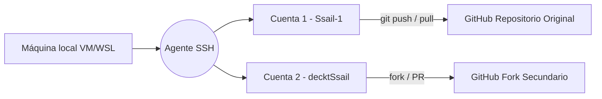

# 🔐 Configuración de SSH en GitHub (una o varias cuentas)


GitHub permite conectarte a tus repositorios sin contraseñas mediante **SSH (Secure Shell)**.
Esto es especialmente útil si manejas varias cuentas (por ejemplo, una principal y otra de pruebas o colaboraciones).

---

- [🔐 Configuración de SSH en GitHub (una o varias cuentas)](#-configuración-de-ssh-en-github-una-o-varias-cuentas)
  - [⚙️ 1️⃣ Generar tus llaves SSH](#️-1️⃣-generar-tus-llaves-ssh)
  - [🧠 2️⃣ Iniciar el agente SSH](#-2️⃣-iniciar-el-agente-ssh)
  - [🧩 3️⃣ Crear el archivo de configuración `config`](#-3️⃣-crear-el-archivo-de-configuración-config)
  - [🔑 4️⃣ Copiar la llave pública](#-4️⃣-copiar-la-llave-pública)
  - [🧪 5️⃣ Probar la conexión](#-5️⃣-probar-la-conexión)
  - [💡 Recomendaciones finales](#-recomendaciones-finales)
  - [🪄 Resultado visual](#-resultado-visual)


---

## ⚙️ 1️⃣ Generar tus llaves SSH

Abre la terminal y ejecuta:

```bash
ssh-keygen -t ed25519 -C "tu_correo@example.com"
```

💬 Explicación rápida:

- `-t ed25519` → define el tipo de cifrado moderno y más seguro.
- `-C` → añade un comentario (normalmente tu correo, para identificar la llave).

Si usas varias cuentas, crea una llave para cada una cambiando el nombre del archivo al final:

```bash
ssh-keygen -t ed25519 -C "correo_principal@example.com" -f ~/.ssh/id_ed25519_ssail
ssh-keygen -t ed25519 -C "correo_secundario@example.com" -f ~/.ssh/id_ed25519_deckt
```

💡 Esto generará dos pares de archivos:

```
id_ed25519_ssail       ← llave privada
id_ed25519_ssail.pub   ← llave pública
id_ed25519_deckt       ← llave privada secundaria
id_ed25519_deckt.pub   ← llave pública secundaria
```

---

## 🧠 2️⃣ Iniciar el agente SSH

El agente mantiene las llaves activas en memoria para no tener que escribir la contraseña en cada uso:

```bash
eval "$(ssh-agent -s)"
```

Deberías ver un mensaje similar a:

```
Agent pid 1234
```

Agrega tus llaves al agente:

```bash
ssh-add ~/.ssh/id_ed25519_ssail
ssh-add ~/.ssh/id_ed25519_deckt
```

✅ Puedes comprobar que quedaron cargadas con:

```bash
ssh-add -l
```

---

## 🧩 3️⃣ Crear el archivo de configuración `config`

Para alternar entre varias cuentas sin confusión, crea el archivo `~/.ssh/config`:

```bash
nano ~/.ssh/config
```

Y agrega este contenido:

```bash
Host github.com-ssail
  HostName github.com
  User git
  IdentityFile ~/.ssh/id_ed25519_ssail

Host github.com-deckt
  HostName github.com
  User git
  IdentityFile ~/.ssh/id_ed25519_deckt
```

💬 **Explicación:**

- `Host` → alias con el que Git reconocerá la cuenta.
- `HostName` → el dominio real de GitHub.
- `User` → siempre “git”.
- `IdentityFile` → la ruta al archivo de la llave privada correspondiente.

Ahora podrás clonar repos de cada cuenta según el alias:

```bash
git clone git@github.com-ssail:Ssail-1/PlatziNotes.git
git clone git@github.com-deckt:decktSsail/PlatziNotes.git
```

---

## 🔑 4️⃣ Copiar la llave pública

Visualiza el contenido de tu llave **.pub** y cópiala:

```bash
cat ~/.ssh/id_ed25519_ssail.pub
```

Luego en GitHub:

> **Settings → SSH and GPG Keys → New SSH key**

Pega el contenido, asigna un nombre descriptivo (ej. “VM principal” o “Secundaria Deckt”).

Repite el proceso para cada cuenta.

---

## 🧪 5️⃣ Probar la conexión

Ejecuta una prueba para cada configuración:

```bash
ssh -T git@github.com-ssail
ssh -T git@github.com-deckt
```

Deberías recibir una respuesta como:

```
Hi Ssail-1! You've successfully authenticated, but GitHub does not provide shell access.
```

Eso confirma que la conexión SSH está activa y segura.

---

## 💡 Recomendaciones finales

✅ Usa **una sola llave por dispositivo** (dos solo si manejas varias cuentas).
✅ **Nunca compartas tus llaves privadas.**
✅ Si cambias de máquina o reinstalas tu SO, vuelve a agregar las llaves en GitHub.
✅ Respáldalas en un lugar seguro (ej. un USB cifrado).
✅ Usa alias consistentes en el archivo `config` para evitar confusiones.

---

## 🪄 Resultado visual



---

✅ Con esto ya tendrás **autenticación SSH profesional**, ideal para manejar varios repositorios y cuentas en el mismo entorno.
Este es el **método más seguro y flexible** para trabajar en GitHub desde terminal.

---

<p align="center">
  <a href="github-essentials-notes.md">🔝 <b>Volver al Índice</b> 🔝</a>
</p>

---
