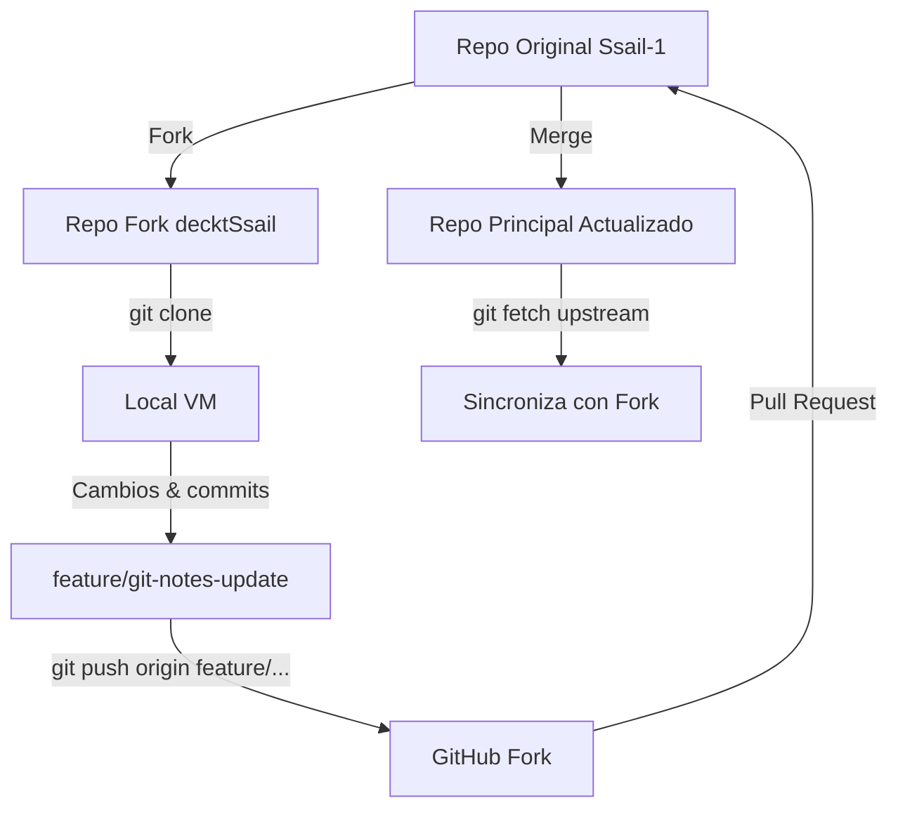

# 🤝 Forks, Pull Requests y Colaboración en GitHub


En GitHub, la colaboración se basa en tres pilares:

1. **Forks** → crear una copia del repositorio original.
2. **Pull Requests (PR)** → proponer cambios.
3. **Code Review y Merge** → revisión y fusión del trabajo.

Este flujo permite contribuir sin afectar directamente al repositorio original, manteniendo orden, seguridad y trazabilidad.

---

- [🤝 Forks, Pull Requests y Colaboración en GitHub](#-forks-pull-requests-y-colaboración-en-github)
  - [🍴 1️⃣ Fork: copiar un repositorio para colaborar](#-1️⃣-fork-copiar-un-repositorio-para-colaborar)
    - [🧩 Cómo crear un fork:](#-cómo-crear-un-fork)
  - [🧭 2️⃣ Clonar tu fork localmente](#-2️⃣-clonar-tu-fork-localmente)
  - [🔗 3️⃣ Conectar el repositorio original como *upstream*](#-3️⃣-conectar-el-repositorio-original-como-upstream)
  - [🔄 4️⃣ Mantener sincronizado tu fork](#-4️⃣-mantener-sincronizado-tu-fork)
  - [🧠 5️⃣ Crear una rama de trabajo](#-5️⃣-crear-una-rama-de-trabajo)
  - [🔃 6️⃣ Crear un Pull Request (PR)](#-6️⃣-crear-un-pull-request-pr)
  - [🧩 7️⃣ Revisión de código (*Code Review*)](#-7️⃣-revisión-de-código-code-review)
  - [⚙️ 8️⃣ Fusionar (Merge) el PR](#️-8️⃣-fusionar-merge-el-pr)
  - [🧹 9️⃣ Limpiar ramas](#-9️⃣-limpiar-ramas)
    - [En GitHub:](#en-github)
    - [En local:](#en-local)
  - [🧭 Flujo visual completo](#-flujo-visual-completo)
  - [💡 Buenas prácticas](#-buenas-prácticas)

---

## 🍴 1️⃣ Fork: copiar un repositorio para colaborar

Un **fork** es una copia completa de otro repositorio, pero dentro de tu cuenta.

📌 **Útil para:**

* Contribuir a proyectos de otros usuarios.
* Practicar sin modificar el código original.
* Trabajar con cuentas paralelas (como hicimos con `decktSsail` y `Ssail-1`).

### 🧩 Cómo crear un fork:

1. En GitHub, abre el repositorio que quieras copiar.
2. Haz clic en el botón **Fork** (esquina superior derecha).
3. Elige tu cuenta como destino.
4. GitHub creará una copia con el mismo nombre y estructura.

💡 En tu caso:

> `Ssail-1/PlatziNotes` → fork → `decktSsail/PlatziNotes`

---

## 🧭 2️⃣ Clonar tu fork localmente

Desde la cuenta donde hiciste el fork (`decktSsail`), clónalo con el alias SSH correspondiente:

```bash
git clone git@github.com-deckt:decktSsail/PlatziNotes.git
```

Esto crea una copia local de tu fork.

Luego entra al directorio:

```bash
cd PlatziNotes
```

---

## 🔗 3️⃣ Conectar el repositorio original como *upstream*

Agrega el repo original (`Ssail-1`) como remoto “upstream” para mantenerte sincronizado:

```bash
git remote add upstream git@github.com-ssail:Ssail-1/PlatziNotes.git
```

💬 Así tendrás:

```
origin   → tu fork (lectura/escritura)
upstream → el original (solo lectura)
```

Puedes confirmar con:

```bash
git remote -v
```

---

## 🔄 4️⃣ Mantener sincronizado tu fork

Cada cierto tiempo, trae los cambios del repo original y actualiza tu fork:

```bash
git fetch upstream
git pull upstream main
git push origin main
```

📌 Esto mantiene tu fork actualizado con la versión más reciente del proyecto principal.

---

## 🧠 5️⃣ Crear una rama de trabajo

Siempre haz tus cambios en una rama nueva, **nunca directamente en `main`**:

```bash
git switch -c feature/nombre-rama
```

💡 Ejemplo:

```bash
git switch -c feature/git-notes-update
```

Realiza tus ediciones y commits normalmente:

```bash
git add .
git commit -m "✨ Actualiza notas de Git y estructura de curso"
```

Sube la rama a tu fork:

```bash
git push origin feature/git-notes-update
```

---

## 🔃 6️⃣ Crear un Pull Request (PR)

Ve a tu fork en GitHub (`decktSsail/PlatziNotes`) y verás un aviso:

> “feature/git-notes-update had recent pushes. Compare & Pull Request.”

1. Haz clic en **Compare & Pull Request**.

2. Asegúrate de que el PR se dirija hacia:

   ```
   base: Ssail-1/main  ←  head: decktSsail/feature/git-notes-update
   ```

3. Escribe un título y descripción claros:

   ```
   ✨ Actualiza documentación de Git Essentials
   - Crea carpeta Imagenes
   - Agrega archivo github-essentials-notes.md
   - Reestructura contenido y créditos
   ```

4. Envía el Pull Request.

---

## 🧩 7️⃣ Revisión de código (*Code Review*)

El propietario del repositorio (en este caso, `Ssail-1`) puede:

* Revisar los cambios línea por línea.
* Comentar sugerencias o errores.
* Solicitar ajustes antes de aprobar.

💬 Es buena práctica contestar los comentarios, aplicar los cambios y subir nuevos commits al mismo PR.

GitHub los añadirá automáticamente a la discusión.

---

## ⚙️ 8️⃣ Fusionar (Merge) el PR

Cuando el PR está aprobado:

1. Haz clic en **Merge Pull Request**.
2. Elige la opción:

   * **Create a merge commit** → conserva todo el historial.
   * **Squash and merge** → compacta todos los commits en uno (más limpio).
3. Confirma el merge.

GitHub integrará los cambios al repositorio original.

---

## 🧹 9️⃣ Limpiar ramas

Después de hacer el merge:

### En GitHub:

GitHub te ofrecerá borrar la rama remota (`Delete branch`).
Haz clic ahí para mantener el repos limpio.

### En local:

```bash
git switch main
git pull origin main
git branch -d feature/git-notes-update
```

---

## 🧭 Flujo visual completo



---

## 💡 Buenas prácticas

✅ Usa ramas por funcionalidad: `feature/`, `hotfix/`, `docs/`, etc.
✅ Escribe mensajes de commit claros y en presente.
✅ Sincroniza tu fork antes de comenzar una nueva tarea (`fetch upstream`).
✅ Nunca trabajes directamente en `main`.
✅ Siempre responde y agradece en los PRs (comunicación profesional).

---

✅ Con este flujo dominas la colaboración en GitHub: **Fork → Branch → PR → Review → Merge**.
Es la base de cualquier entorno de trabajo en equipo moderno.

---

<p align="center">
  <a href="github-essentials-notes.md">🔝 <b>Volver al Índice</b> 🔝</a>
</p>

---
