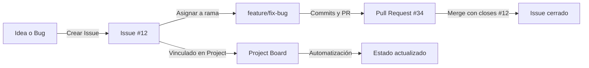

# 🧩 Issues y GitHub Projects — Planificación Colaborativa


> Los **Issues** son el sistema de registro de tareas, errores o ideas dentro de un repositorio.
> Los **Projects** son tableros visuales que ayudan a planificar y dar seguimiento a esas tareas.
> Juntos forman el corazón de la gestión colaborativa en GitHub. 💡

---

- [🧩 Issues y GitHub Projects — Planificación Colaborativa](#-issues-y-github-projects--planificación-colaborativa)
  - [🧠 1️⃣ Issues — seguimiento de tareas o problemas](#-1️⃣-issues--seguimiento-de-tareas-o-problemas)
    - [🧩 Crear un Issue](#-crear-un-issue)
  - [⚙️ 2️⃣ Vincular un Issue con un Pull Request](#️-2️⃣-vincular-un-issue-con-un-pull-request)
  - [🧩 3️⃣ Crear plantillas de Issues](#-3️⃣-crear-plantillas-de-issues)
    - [📁 Estructura](#-estructura)
  - [🗂️ 4️⃣ Projects — planificación visual de trabajo](#️-4️⃣-projects--planificación-visual-de-trabajo)
    - [🧭 Crear un Project](#-crear-un-project)
    - [🧩 Agregar tareas al Project](#-agregar-tareas-al-project)
  - [⚡ 5️⃣ Automatizaciones](#-5️⃣-automatizaciones)
  - [🧩 6️⃣ Flujo visual completo](#-6️⃣-flujo-visual-completo)
  - [💡 Buenas prácticas](#-buenas-prácticas)

---

## 🧠 1️⃣ Issues — seguimiento de tareas o problemas

Un **Issue** representa una conversación abierta sobre algo que requiere atención:
puede ser un *bug*, una *nueva funcionalidad*, una *mejora*, o incluso un *recordatorio*.

### 🧩 Crear un Issue

1. Abre tu repositorio en GitHub.
2. Haz clic en la pestaña **Issues → New Issue**.
3. Rellena los campos:

   * **Title:** resumen claro del problema o tarea.
   * **Description:** pasos para reproducir el error o propuesta de solución.
4. (Opcional) Asigna etiquetas (**labels**) como:

   * `bug` → errores
   * `enhancement` → mejoras
   * `documentation` → tareas de docs
   * `help wanted` → se necesita ayuda

💬 Ejemplo:

```
Title: Error al sincronizar rama main
Description:
Al hacer git pull origin main, aparece conflicto en README.md.
Posible causa: cambios simultáneos entre ramas.
```

---

## ⚙️ 2️⃣ Vincular un Issue con un Pull Request

Cuando trabajes en una rama que solucione un problema, menciona el número del issue en el mensaje del commit o PR:

```bash
git commit -m "fix: corrige conflicto en README.md (closes #12)"
```

💡 **`closes #12`** cierra automáticamente el Issue número 12 cuando el PR es fusionado.

O bien, en la descripción del PR puedes poner:

> `Resolves #12` o `Fixes #12`

Esto mantiene la trazabilidad entre el código y la tarea original.

---

## 🧩 3️⃣ Crear plantillas de Issues

GitHub permite crear **plantillas Markdown** para estandarizar la información que los colaboradores llenan.

### 📁 Estructura

Dentro del repositorio, crea la carpeta:

```
.github/ISSUE_TEMPLATE/
```

Y dentro, por ejemplo:

**`bug_report.md`**

```markdown
---
name: Reporte de Bug
about: Describe un problema encontrado
title: "[BUG] Título corto"
labels: bug
---

### Descripción
Describe brevemente el error.

### Pasos para reproducir
1. Ir a '...'
2. Hacer clic en '...'

### Resultado esperado
Describe qué debería pasar.

### Capturas de pantalla
Si aplica, agrega imágenes aquí.
```

**`feature_request.md`**

```markdown
---
name: Solicitud de Funcionalidad
about: Proponer una nueva característica
title: "[FEATURE] Nueva idea"
labels: enhancement
---

### Descripción
Explica qué problema resolvería o qué mejora agregaría.
```

💡 Esto mejora la comunicación y profesionaliza el repositorio.

---

## 🗂️ 4️⃣ Projects — planificación visual de trabajo

Los **Projects** son tableros tipo *Kanban* (como Trello), donde puedes organizar Issues y Pull Requests según su estado.

### 🧭 Crear un Project

1. En el repositorio → pestaña **Projects → New Project**.
2. Elige el tipo:

   * **Board:** tablero estilo Kanban (*To do / In Progress / Done*).
   * **Table:** tabla con filtros y campos personalizados.
3. Nómbralo y añade una descripción (ej. “Desarrollo del curso GitHub Essentials”).

### 🧩 Agregar tareas al Project

Puedes añadir:

* Issues existentes.
* Pull Requests abiertos.
* Notas personalizadas (para ideas o pendientes).

Ejemplo de columnas:

| 🕓 To do     | ⚙️ In progress | ✅ Done              |
| ------------ | -------------- | ------------------- |
| Crear README | Documentar PRs | Cerrar curso GitHub |

---

## ⚡ 5️⃣ Automatizaciones

GitHub Projects permite automatizar el movimiento de tareas:

* Cuando un **PR se abre**, pasa a *In Progress*.
* Cuando un **PR se fusiona o se cierra**, pasa a *Done*.
* También puedes automatizarlo con **GitHub Actions** (para flujos más avanzados).

💡 Esto ahorra tiempo y mantiene tu tablero siempre actualizado.

---

## 🧩 6️⃣ Flujo visual completo



---

## 💡 Buenas prácticas

✅ Usa etiquetas consistentes para identificar tipos de tarea.
✅ Crea plantillas de Issues para mejorar la claridad.
✅ Vincula Issues y PRs para mantener trazabilidad.
✅ Cierra Issues solo con commits o merges (no manualmente).
✅ Revisa tu Project semanalmente para mantener el flujo limpio.

---

✅ Con esto dominamos la **gestión colaborativa completa en GitHub**:
desde reportar problemas hasta planificar el desarrollo visualmente.
Es la base para trabajar de forma profesional en equipo o en proyectos open source. 🌍

---

<p align="center">
  <a href="github-essentials-notes.md">🔝 <b>Volver al Índice</b> 🔝</a>
</p>

---
